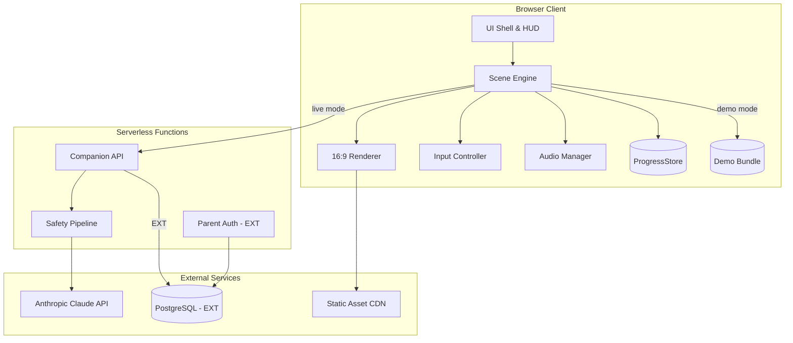
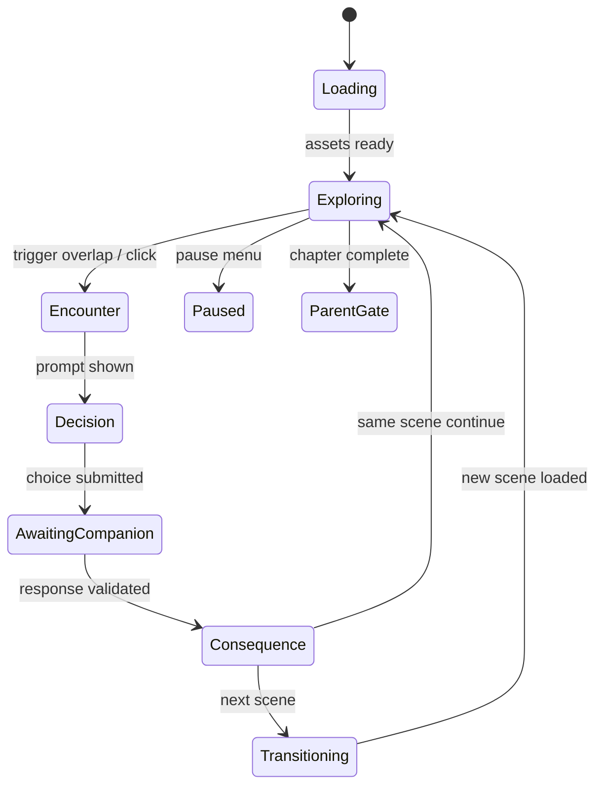
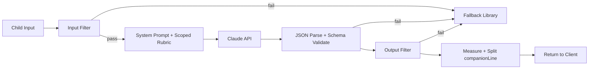

# TruNorth — Consolidated Technical Specification

**Engineering implementation guide, delivery-readiness audit, and enterprise extension map**

| Field | Value |
|---|---|
| Document type | Build-ready engineering specification (single source of truth) |
| Product | TruNorth — choice-driven social-emotional learning (SEL) narrative for children ages 5–15 |
| Version | v3.0 — consolidated from Phase 1 (Draft v1), Phase 2 (Rebuilt v2.0 gap audit), and Phase 3 (Formatted v1.1 + Enterprise Addendum) |
| Derived from | TruNorth Master Spec.md (Draft v2) |
| Audience | Full-stack developers, technical leads, DevOps, QA, product owner, safety/SME reviewers, counsel |
| Owner | Madhusudhan Chillara · Dallas AI · Summer 2026 Cohort |
| Status | Build-ready. MVP first; EXT designed-in but non-blocking; Enterprise extensions governed separately. |
| Overall resolution confidence | **0.86 / High** for engineering structure; **Medium** where legal, SEL, or clinical SME validation is required. |

> **How this document was consolidated.** Phase 1 and Phase 3 share an identical baseline spec (Sections 1–23). Phase 2 is a delivery-readiness rebuild that **supersedes several Phase 1 platform decisions** and adds governance artifacts. Phase 3 adds an enterprise/school-deployment addendum. This document merges all three: the baseline is updated in place with Phase 2's current platform decisions, the governance artifacts are integrated as Part II, and the enterprise material is preserved as Part III, clearly marked **[EXT]**. Every place a Phase 1 decision was superseded is recorded in [Appendix F — Consolidation change log](#appendix-f--consolidation-change-log).

---

## Conventions

- **[MVP]** — required for the first production-grade showcase build.
- **[EXT]** — designed-in for future extension; must **not** block the showcase delivery path.
- **[ENTERPRISE]** — school/district deployment model (Part III); governed separately from the parent–child MVP; EXT unless the Product Owner explicitly promotes it.
- Code blocks are implementation sketches, not final source.
- Tables tagged with **owner** or **confidence** require product, legal, SME, or engineering sign-off.

## Source-of-truth hierarchy

Conflicts are resolved top-down:

1. **TruNorth Master Spec** and approved safety/SEL policy documents.
2. Approved **SME/counsel rulings** for child safety, COPPA, privacy, and sensitive themes.
3. **This consolidated technical specification.**
4. **Architecture Decision Records (ADRs)** linked to implementation tickets.
5. Repository README and inline code comments.

> Any conflict involving child safety, privacy, therapeutic framing, or data collection must be escalated to **owner + SME + counsel** before implementation proceeds.

---

# Table of contents

**Part I — Foundation (build-ready MVP spec)**
1. Executive summary
2. Architecture overview
3. Technology stack
4. Repository & project structure
5. Frontend: scene engine & runtime
6. Screen, viewport & layout configuration
7. Asset pipeline & image configuration
8. Character system
9. Content & scene data model
10. Game state & progression
11. AI companion & serverless proxy
12. Persistence layer
13. Parent gate & trust surfaces
14. Audio & feedback systems
15. Demo mode & stage readiness
16. Security, privacy & compliance
17. Testing & quality assurance
18. DevOps, CI/CD & deployment
19. Performance budgets
20. Accessibility implementation
21. MVP vs EXT scope matrix
22. Implementation phases
23. Open engineering decisions

**Part II — Delivery readiness & governance**
24. Gap register & resolution
25. Architecture Decision Records (ADRs)
26. Risk register
27. Definition of Done & acceptance criteria
28. Confidence matrix

**Part III — Enterprise extensions [ENTERPRISE / EXT]**
29. Enterprise architecture addendum

**Appendices**
- A. Quick reference: showcase golden path
- B. Reference documents
- C. Canonical file structure
- D. Sample schemas & interfaces
- E. Source notes & platform currency
- F. Consolidation change log

---

# Part I — Foundation

## 1. Executive summary

TruNorth is a web-based, choice-driven narrative adventure for children ages 5–15. Technically, it is **not a game-engine product**. It is a content-driven **scene-graph state machine** rendered in the browser with a custom lightweight runtime, an **AI companion proxied server-side**, and a **frozen illustrated asset pipeline**. The runtime uses DOM layers, CSS transforms, and narrowly scoped Canvas 2D effects for particles and world feedback. Content files drive scene layout, decision points, scoring, companion prompts, consequences, and repair actions.

### 1.1 What engineers build

| Layer | Responsibility |
|---|---|
| Scene runtime | Load scenes from JSON/YAML, render 16:9 letterboxed viewport, handle Tier A/B movement, decision points, consequences |
| Companion proxy | Serverless API holding Claude credentials; five-layer safety stack; structured JSON responses |
| Progress store | Single `ProgressStore` interface; local (MVP) and remote (EXT) implementations |
| Asset system | Manifest-driven sprites, backgrounds, FX; expression-state swapping; progressive preload |
| Parent surfaces | Child-resistant gate, trust screen, watch/co-play mode |

### 1.2 Non-negotiable technical constraints (from product spec)

- **No game engine** (Phaser, Unity, Godot ruled out).
- **No API keys in the browser** — all Claude calls via serverless proxy.
- **No open-ended chat** — every typed interaction is scoped to an active `decisionPointId` and a bounded scoring rubric.
- **Demo mode must run fully offline** with zero network dependency and a visible demo-mode indicator.
- **MVP platform:** desktop, laptop, Chromebook with physical keyboard/mouse (touch deferred to EXT).
- **Safety, privacy, and child-trust requirements are release-blocking.** Movement fidelity (Tier B) and visual polish yield to safety when schedule conflicts.

---

## 2. Architecture overview

### 2.1 High-level system diagram



### 2.2 Core architectural pattern

**Scene-graph state machine + single canonical game-state object.**

```
Scene Graph (content)     Game State (runtime)        Render Loop
─────────────────────     ────────────────────        ───────────
Scene W1 ──► W2           currentSceneId              rAF @ 60fps
     │         │          meters, points              DOM/canvas layers
     │         ▼          companionLevel              bubble tracking
     └──► W3a/W3b         emotionalResidue            overlap checks
              │           eventLog[]
              ▼
             W4
```

Every transition mutates one canonical `GameState` object persisted through `ProgressStore`. **Scenes reference assets and routing by ID — never by file path** in content files.

### 2.3 Tier A / Tier B movement abstraction

Movement is a configurable layer, not woven through scene logic. Downgrading a chapter from Tier B to Tier A is a **chapter-level configuration flag, not a content rewrite**.

```ts
interface ChapterConfig {
  chapterId: string;
  movementTier: 'A' | 'B';        // Tier B = keyboard + AABB overlap; Tier A = click-to-trigger
  inputProfile: 'keyboard_mouse' | 'touch_ext';
  safetyOverrides?: { disablePlayfulExternalization?: boolean };
}
```

---

## 3. Technology stack

The stack balances the master spec's vanilla, no-engine mandate with industrial full-stack standards: type safety, automated testing, schema validation, observability, and a clear path from MVP (local-only) to EXT (accounts + sync).

> **Platform currency note.** Version choices below reflect the Phase 2 (June 2026) currency review and **supersede the original Phase 1 picks** (Vite 6 → 8, Node 22 → 24, ambiguous Claude alias → pinned Haiku 4.5, Vercel Edge → Vercel Functions Node runtime). Each greenfield platform choice carries a verification gate — see [Section 25 (ADRs)](#25-architecture-decision-records-adrs).

### 3.1 Recommended stack (MVP + growth path)

| Concern | Technology | Rationale |
|---|---|---|
| Language | TypeScript 5.x | Type-safe scene schemas, rubric contracts, event models, CI validation |
| Build tool | **Vite 8.x, pinned** | Current fast build/HMR, asset bundling, env injection, static export for offline demo. Validate plugin ecosystem and browser targets in a one-day spike before lock (ADR-001) |
| Frontend framework | None (custom runtime) | No game engine; scene engine is purpose-built. Web Components or plain modules for UI chrome only |
| Rendering | DOM layers + CSS transforms; Canvas 2D only for particles/FX | Matches no-engine requirement; keeps accessibility and layout inspection straightforward |
| Styling | CSS Modules or vanilla CSS with design tokens | Predictable theming for parent gate vs child UI |
| State management | Custom `GameState` + event bus | Single source of truth; no Redux overhead |
| Content validation | JSON Schema + Ajv (+ optional Zod runtime validators) | CI gate: scenes, decision points, asset refs, and AI response contracts must validate including `emotionalArc` |
| Package runtime | **Node.js 24.x LTS preferred**; 22.x compatibility fallback only if CI/demo env is constrained | Avoid starting a 2026 build near Node 22 EOL |
| Serverless runtime | **Vercel Functions (Node.js runtime) default**; Netlify Functions alternate | Avoid deprecated standalone Vercel Edge Functions. Netlify Edge only if CPU/env-var limits accepted (ADR-002) |
| AI model | **Claude Haiku 4.5, production-pinned dated ID** | Low-latency, cost-effective in-character turns; model exposed via env config; lifecycle-tested (ADR-004) |
| MVP persistence | `LocalProgressStore` over localStorage (+ optional IndexedDB for larger event cache) | Offline-capable, no accounts |
| EXT database | PostgreSQL via Supabase or Neon | Managed, auditable; RLS/auth path or serverless-driver path (ADR-003) |
| EXT auth | Supabase Auth or Clerk (**parent-only**) | Industry-standard OAuth/email; the child never authenticates directly |
| EXT object storage | Supabase Storage or S3 + CloudFront | Asset CDN; no user uploads from children |
| CI/CD | GitHub Actions | Lint, typecheck, schema validate, unit, red-team, build, E2E, artifact audit |
| E2E testing | Playwright (current major, pinned) | Keyboard movement, decision flows, viewport sizes, offline demo, network mocking |
| Unit/integration | Vitest (current major, pinned) | Scene routing, scoring, residue, safety filters, store |
| Monitoring | Sentry (errors/perf, aggressive scrubbing) + Vercel/Netlify non-PII analytics | Production observability; **no child transcript logging** |
| Secrets | Vercel/Netlify env vars | Never in repo or client bundle |

### 3.2 Explicitly excluded

| Excluded | Reason |
|---|---|
| Unity / Phaser / Godot | Ruled out by product shape and runtime constraints |
| React / Vue / Angular as game shell | Permitted only for the EXT parent dashboard; the game runtime stays custom |
| WebSocket / real-time | No multiplayer; request/response companion only |
| Browser Speech API in MVP | Privacy/COPPA; deferred to EXT behind counsel + SME gate |
| Persistent raw child transcripts in cloud | Disallowed unless legal/parental consent and safety review explicitly approve |
| Open-ended companion chat | Product stays scene- and decision-point-scoped |

### 3.3 Version pinning policy

- Pin major versions in `package.json`; use Dependabot for security patches.
- Lock Node.js to LTS via `.nvmrc` (24.x preferred).
- Document a browser support matrix: Chrome 120+, Edge 120+, Safari 17+ (the demo machine is single-browser).
- Maintain a lockfile; run a quarterly dependency/model review (see [Section 11.6](#116-model-lifecycle-policy)).

---

## 4. Repository & project structure

The canonical layout (consolidating Phase 1 and Phase 2's expanded tree) is in [Appendix C](#appendix-c--canonical-file-structure). Summary:

- `api/` — serverless functions (`companion/route.ts`, `health/route.ts`, `progress/[childId].ts` [EXT])
- `content/` — `schema/`, `chapters/`, `demo/`, `fallbacks/`, `rubrics/` [EXT-supplied by SME]
- `public/assets/` — built static assets + generated `manifest.json`
- `assets-src/` — source art, `manifest.yaml`, `provenance-ledger.csv`, `art-style-guide.md`
- `scripts/` — `validate-content.ts`, `build-asset-manifest.ts`, `red-team-suite.ts`, `audit-bundle-size.ts`
- `src/` — `engine/`, `render/`, `input/`, `ui/`, `companion/`, `safety/`, `store/`, `audio/`, `types/`
- `tests/` — `unit/`, `integration/`, `e2e/`, `red-team/`
- `docs/` — `adr/`, `privacy/`, `demo-runbook.md`, `incident-response.md`

---

## 5. Frontend: scene engine & runtime

### 5.1 Scene engine responsibilities

| Module | Responsibility |
|---|---|
| `SceneEngine` | Orchestrates load → explore → encounter → decide → consequence → route |
| `SceneGraph` | Resolves `nextSceneId` from consequence bands; bounded branching |
| `DecisionResolver` | Maps choice/typed input → `scoreBand`; updates meters; appends event log |
| `MovementController` | WASD/arrow keys; avatar position; idle animation |
| `CollisionSystem` | AABB overlap for triggers, NPCs, collectibles |
| `EmotionalResidue` | Per-character enum read/write from event log |

### 5.2 Main game loop

```ts
// requestAnimationFrame loop
function gameLoop(timestamp: number) {
  const delta = clock.tick(timestamp);
  if (!state.inputFrozen) {
    movement.update(delta);
    collision.check(avatar, scene.triggers, scene.collectibles);
    bubbleManager.trackSpeakerAnchors(scene.characters); // pin bubbles to sprite anchors
  }
  renderer.render(state, scene, delta);
  requestAnimationFrame(gameLoop);
}
```

### 5.3 Scene lifecycle states



| State | Engineering behavior |
|---|---|
| Loading | Resolve scene JSON, validate asset refs, load background/sprites/FX/audio cues |
| Exploring | Avatar moves or child clicks; triggers and collectibles active |
| Encounter | NPC/decision trigger starts; input and camera stabilized |
| Decision | Choice cards or typed input display; `decisionPointId` becomes the **only** allowed AI scope |
| AwaitingCompanion | Movement frozen; in-character thinking cue; timeout/fallback timer starts |
| Consequence | Score band applied; meters, residue, repair actions, and routing resolve |
| Transitioning | Persist state, preload next scene, release input on completion |

### 5.4 Input freeze during companion fetch

When `CompanionClient.request()` is in flight:

1. Unmap movement and trigger listeners.
2. Set avatar to idle animation.
3. Show companion "thinking" overlay (in-character, not a spinner).
4. Release on resolve, fallback, or timeout.

This prevents `ProgressStore` race conditions (master spec §17B.9).

### 5.5 Dialogue system

| Feature | Implementation |
|---|---|
| Overhead bubbles | DOM elements anchored to sprite `anchorPoint`; flip below head near top edge |
| Progressive text | Char-by-char reveal; tap-to-complete state machine (§17B.6 truth table) |
| Bubble overflow | Server splits `companionLine` > 120 chars; client sequences click-through |
| Speaker sequencing | One active bubble at a time for Ch.1 |
| `pivotLockMs` | Configurable per decision point; default 2000 ms at emotional pivots |

---

## 6. Screen, viewport & layout configuration

### 6.1 Canonical viewport

All game coordinates are relative to a fixed logical canvas.

| Property | Value |
|---|---|
| Aspect ratio | 16:9 (locked) |
| Logical resolution | 1920 × 1080 (authoring reference) |
| Scaling | Uniform `transform: scale()` to fit viewport; letterbox bars on non-16:9; **do not stretch** |
| Coordinate system | Origin top-left; positions in logical px relative to the scaled container |
| Z-order layers | background → world FX → characters → avatar → bubbles → HUD → overlays |
| Projector/demo | Verify at 1024×768, 1366×768, 1920×1080, and projector mirror mode |

```css
.game-root {
  width: 100vw; height: 100vh;
  display: grid; place-items: center;
  background: #1a1a2e;
}
.game-viewport {
  position: relative;
  aspect-ratio: 16 / 9;
  width: min(100vw, calc(100vh * 16 / 9));
  height: min(100vh, calc(100vw * 9 / 16));
  overflow: hidden;
}
.letterbox-bar { background: #1a1a2e; }
```

### 6.2 Screen surfaces (MVP)

| Surface ID | Route / trigger | Primary layout |
|---|---|---|
| `onboarding.parent` | First launch | Grown-up palette; age band + PIN setup; consent/trust summary |
| `onboarding.companion` | Child flow | Full-screen archetype picker + naming; no PII encouragement |
| `onboarding.avatar` | Child flow | Skin/hair grid; large hit targets; no text required |
| `onboarding.strength` | Child flow | Picture choices → `baselineStrength` |
| `onboarding.movement` | Tier B only | Non-textual mimic tutorial |
| `game.scene` | Active play | 16:9 world + quiet meter HUD; keyboard movement if Tier B |
| `game.decision` | Overlay on scene | Large choice cards / scoped typed field; no free-form chat surface |
| `game.celebration` | Chapter end | Full-screen high-saturation payoff; optional recap |
| `parent.gate` | Between chapters | Distinct grown-up surface; PIN/math; cooldown after repeated failures |
| `parent.trust` | Settings / first-run | Plain-language companion boundaries and data controls |
| `parent.watch` | Co-play / side-by-side | Child screen mirror + coach's corner; cannot override child input |
| `system.resume` | Return visit | In-character re-entry (distress-aware branch) |
| `system.error` | API failure | In-character safe fallback line; never raw server/API errors |

### 6.3 HUD configuration

| Element | Position (logical 1920×1080) | Ch.1 visibility | Notes |
|---|---|---|---|
| Skill meters | Top-right cluster | 3 meters (Empathy, Calm, Courage) | Animate only on change |
| Brownie points | Top-left counter | Always | Icon + number |
| Diegetic path | Bottom-center in-world | Optional | Stepping stones, not a chrome bar |
| Demo mode pill | Top-left corner | When active | "Demo Mode" indicator |
| Pause | Hidden corner tap | Always | Calm freeze frame |

### 6.4 Age-banded UI tokens

```ts
const UI_TOKENS = {
  ch1: { hitTargetMinPx: 64, dialogueFontPx: 22, choiceCardHeight: 120, meterShowsNumbers: false }, // font floor 20–24
  ch2: { hitTargetMinPx: 48, dialogueFontPx: 18, typedInputEnabled: true },
  ch3: { hitTargetMinPx: 48, dialogueFontPx: 16, typedInputPrimary: true },                          // font floor 16
} as const;
```

| Band | Hit target | Dialogue font floor | Input mode | Meter display |
|---|---|---|---|---|
| 5–7 / Ch.1 | 64 px min | 22 px target, never < 20 px | Choice-first; typed disabled unless approved | Icon/visual fill only |
| 8–10 / Ch.2 | 48–56 px min | 18–20 px | Choice + short typed prompts | Icon + label; no numeric pressure |
| 11–15 / Ch.3+ | 48 px min | 16–18 px | Typed may become primary where rubric supports it | More explicit skill naming allowed |

### 6.5 Typography

| Use | Font | Fallback |
|---|---|---|
| Dialogue | Quicksand or Nunito | `system-ui, sans-serif` |
| Dyslexia option | Lexend | user setting |
| Parent gate | Inter or Source Sans 3 | distinct from child UI |
| Bubble text color | `#3d3d3d` on `#faf8f5` | contrast ≥ 4.5:1 |

### 6.6 Projector / demo display

- Test the showcase scene at 1024×768 and 1920×1080.
- Meter fill animations must be legible from ~15 m (master spec §13A.4).
- Global mute control; the venue may have no audio.

---

## 7. Asset pipeline & image configuration

### 7.1 Art style lock & provenance

- **Style:** AI-generated "clean cartoon" — single frozen style-guide document.
- **Lock window:** Week 1–2; no regeneration after freeze without a version bump.
- **Review gate:** SME + art lead sign-off before `manifest.lock`.
- **Provenance [from Phase 2 G09]:** every AI-generated or third-party asset requires a record in `assets-src/provenance-ledger.csv`: source prompt, generation date, usage license, editor, approval state, and replacement policy. No unreviewed regeneration (ADR-005).
- Showcase-path assets are fully preloaded before the presenter starts the stage flow.

### 7.2 Image format & export standards

| Asset type | Format | Resolution (logical) | Validation / notes |
|---|---|---|---|
| Scene backgrounds | WebP (PNG fallback) | 1920 × 1080 | Full-bleed; safe zone for HUD/bubbles; no baked-in text unless localized |
| Character sprites | WebP + PNG | See §7.3 (128–160 px base) | Transparent background; anchors + expression frames declared in manifest |
| Companion level variants | WebP | Same base dimensions | Swapped at level thresholds |
| UI chrome / meters | SVG where possible | Scalable | CSS-tintable fills; contrast + reduced-motion compatible |
| Particles / FX | CSS + small PNG sprites | 32–64 px | Burst cap ≤ 12; disabled by reduced motion |
| Celebration cards | WebP | 1920 × 1080 | Full-screen overlay |
| Audio | MP3 + OGG | — | Short SFX < 100 KB; global mute; never sole feedback channel |

### 7.3 Character sprite specifications

| Property | Specification |
|---|---|
| Anchor point | Feet center for ground characters; `(0.5, 1.0)` of sprite |
| Bubble anchor | Head top; `(0.5, 0.0)` + offset −24 px |
| Base size (child avatar) | 128 × 128 logical px (Ch.1); scale uniformly |
| Base size (companion) | 160 × 160 logical px |
| Base size (NPC) | 144 × 144 logical px |
| Expression states | Minimum 3 per character: `neutral`, `worried_sad`, `excited_glow` |
| Poor-band body language | Scale 0.92 + slight tilt; SME reviews animated |
| Directionality | 4-way or flip-X for left/right movement |
| Animation | Sprite sheet or stepped poses: idle, walk, react |

### 7.4 Asset manifest schema

Scenes reference `assetRef`, never paths:

```yaml
# assets-src/manifest.yaml
version: "1.0.0"
styleGuide: docs/art-style-guide.md
characters:
  companion_fox_base:
    file: characters/companion/fox_base.webp
    width: 160
    height: 160
    anchor: [0.5, 1.0]
    expressions:
      neutral: { frame: 0 }
      worried_sad: { frame: 1 }
      excited_glow: { frame: 2, glow: true }
    levels:
      1: companion_fox_base
      2: companion_fox_level2
      3: companion_fox_level3
  robin:
    file: characters/npc/robin.webp
    width: 144
    height: 144
    expressions:
      neutral: { frame: 0 }
      worried: { frame: 1 }
      relieved_grin: { frame: 2 }
backgrounds:
  clearing_treehouse:
    file: backgrounds/ch2/clearing_day.webp
    width: 1920
    height: 1080
fx:
  worry_cloud_lg:
    file: fx/worry_cloud_big.webp
    width: 200
    height: 120
    variants: [big, medium, small, gone]
```

`build-asset-manifest.ts` emits `public/assets/manifest.json` and validates that all referenced files exist.

```ts
interface AssetManifestCharacter {
  file: string;
  width: number;
  height: number;
  anchor: [number, number];        // feet center: [0.5, 1.0]
  bubbleAnchor: [number, number];  // head top: [0.5, 0.0]
  expressions: Record<string, { frame: number; glow?: boolean }>;
  animations?: Record<'idle' | 'walk' | 'react', string>;
}
```

### 7.5 Avatar configuration (player representation)

```ts
interface AvatarConfig {
  skinTone: 'tone_1' | 'tone_2' | 'tone_3' | 'tone_4' | 'tone_5';
  hair: 'hair_curly' | 'hair_straight' | 'hair_braids' | 'hair_short' | 'hair_puffs';
}
```

- Composed from layered sprites (body base + hair overlay) or pre-composed variants.
- 5×5 matrix maximum for MVP; expand post-launch.
- Stored on the child profile; rendered as the movement sprite in Tier B.

### 7.6 Preload strategy

| Phase | Assets loaded |
|---|---|
| App boot | Core UI, fonts, companion base, avatar |
| Chapter enter | All backgrounds + NPCs for the chapter |
| Scene enter | Scene-specific FX, audio cues |
| Showcase demo | Entire W1–W4 path preloaded before stage (§13A.5) |

Use `Promise.all` + a progress "Ready" gate for the demo presenter.

### 7.7 Showcase scene asset checklist

| Asset | `assetRef` | States / variants |
|---|---|---|
| Sunny clearing + treehouse | `bg_clearing_day` | 1 |
| Treehouse close-up (W4) | `bg_treehouse_rung` | 1 |
| Robin | `char_robin` | worried, shaky_nod, relieved_grin |
| Companion (chosen archetype) | `char_companion_*` | neutral, proud, glow |
| Child avatar | `char_avatar_*` | walk, idle |
| Worry cloud | `fx_worry_cloud` | big → medium → small → gone |
| Celebration | `ui_celebration_worry_brave` | 1 |
| Worry & Brave meter art | `ui_meter_worry_brave` | empty, partial, full |
| Brownie / Kindness Spark | `collectible_spark` | default, hidden |

---

## 8. Character system

### 8.1 Character taxonomy

| Type | ID prefix | Customizable | Dialogue / AI voice |
|---|---|---|---|
| Player avatar | `avatar_` | Skin tone + hair | N/A |
| Companion | `companion_` | Child-given name + archetype + level appearance | Claude persona via scoped proxy + fallback lines |
| Supporting NPC | `npc_` | None in MVP | Authored dialogue; emotional residue affects default expression |
| Grown-up figure | `npc_adult_` | None in MVP | Authored ask-for-help anchor; absent from parent gate |

### 8.2 Companion archetypes (configurable asset set)

| ID | Archetype | MVP status |
|---|---|---|
| `companion_fox` | Friendly animal | Recommended |
| `companion_sprite` | Magical spirit | Recommended |
| `companion_kid` | Kid friend | Roadmap |
| `companion_robot` | Gadget pal | Roadmap |
| `companion_shifter` | Level-up morph | Roadmap |
| `companion_duo` | Pair (primary named, secondary fixed) | Roadmap |

Archetype selection swaps the asset set + `{COMPANION_VOICE}` flavor table — **not** safety or scoring logic.

### 8.3 Companion naming pipeline

```ts
interface CompanionContext {
  name: string;        // child-given; injected in prompts as {NAME}
  archetypeId: string;
  level: 1 | 2 | 3;
  voiceProfile: VoiceProfile;
}
```

- Name stored in `GameState.profile.companionName`.
- Validated: max 20 chars; profanity filter; no PII patterns.
- Default suggestions: `["Pip", "Spark", "Buddy", "Luna", "Ash"]`.

### 8.4 Expression state machine

```ts
type ExpressionState = 'neutral' | 'worried_sad' | 'excited_glow';

function expressionForBand(band: ScoreBand, sensitivity: ThemeSensitivity): ExpressionState {
  if (band === 'strong') return 'excited_glow';
  if (band === 'poor' && sensitivity === 'standard') return 'worried_sad';
  return 'neutral';
}
```

`companionStance` from `emotionalArc` selects among loaded expression assets — it does not define new art.

### 8.5 Supporting cast (MVP narrative vehicles)

| Character | ID | Themes | Expression states |
|---|---|---|---|
| Left-out kid | `npc_leftout` | Empathy, Friendship | 3 min |
| Hot-tempered friend | `npc_hothead` | Calm | 3 min |
| Worried friend (Robin) | `npc_robin` | Worry & Brave | 3 min + worry cloud |
| Family-changing friend | `npc_sam` | Adapting to Change | 3 min; SME draft |
| Self-doubter | `npc_doubter` | Self-Worth | 3 min |
| Kid who messed up | `npc_messup` | Friendship & Repair | 3 min |
| Trusted grown-up | `npc_grownup` | Ask for Help | 3 min |

### 8.6 Emotional residue (per chapter)

```ts
type ResidueLevel = 'trusting' | 'neutral' | 'shaken';
interface ChapterResidue { [npcId: string]: ResidueLevel; }
```

- Derived from the event log after NPC decision points.
- Affects NPC default expression and companion opener — **never blocks progress**.
- Off by default for Ch.1 if SME judges it too subtle.

---

## 9. Content & scene data model

### 9.1 Content governance [from Phase 2 G14]

- Every scene, decision point, and fallback line carries a `version`, `owner`, `approvalState`, and `lastSmeReviewDate`.
- Content changes run schema validation, golden-path E2E, the red-team suite where applicable, and the text-off emotional read for critical scenes.
- Sensitive themes must carry `themeSensitivity: "sensitive"` and cannot use playful externalization unless SME explicitly approves and the code gate allows it.
- Branching stays bounded — use consequence bands and repair actions instead of uncontrolled narrative explosion.

### 9.2 Scene schema (authoritative)

```json
{
  "id": "w2",
  "chapterId": "ch2",
  "order": 2,
  "movementTier": "B",
  "background": "bg_clearing_day",
  "narration": "Robin keeps looking up at the ladder…",
  "characters": [
    { "assetRef": "char_robin", "id": "robin", "position": [960, 720], "expression": "worried" },
    { "assetRef": "char_companion_fox", "id": "companion", "position": [720, 780] }
  ],
  "triggers": [
    { "id": "robin_encounter", "bounds": [880, 680, 160, 160], "action": "startDecision", "target": "dp_robin_ladder" }
  ],
  "collectibles": [
    { "id": "spark_1", "assetRef": "collectible_spark", "position": [400, 800], "kind": "kindness_spark", "gate": "strong_path" }
  ],
  "decisionPoints": ["dp_robin_ladder"]
}
```

### 9.3 Decision point schema

```json
{
  "id": "dp_robin_ladder",
  "prompt": "Robin is scared to climb. What do you do?",
  "inputMode": "both",
  "themeSensitivity": "standard",
  "selSkills": ["worry_brave", "empathy"],
  "pivotLockMs": 2000,
  "options": [
    {
      "id": "opt_a",
      "label": "It's okay to feel scared. Want to try just the first step together?",
      "icon": "icon_helping_hand",
      "selScore": "strong",
      "consequenceRef": "cons_w2_strong"
    }
  ],
  "companionContext": {
    "situation": "Robin frozen at ladder, worry cloud visible",
    "npcEmotion": "anxiety",
    "ageBand": "8-10"
  },
  "consequences": [
    { "band": "strong", "sceneId": "w3a", "fx": ["worry_cloud_shrink"], "meterDeltas": { "worry_brave": 1.0, "empathy": 0.25 }, "repairAction": null },
    { "band": "poor", "sceneId": "w2", "fx": ["worry_cloud_darken"], "repairAction": "walk-back" }
  ],
  "emotionalArc": {
    "childStateEntering": "curious, slightly concerned",
    "childStateExiting": {
      "strong": "empowered, proud, connected",
      "partial": "uncertain, nudged toward reflection",
      "poor": "guilty-but-safe (shame interrupted immediately)"
    },
    "companionStance": {
      "strong": "warm, upright, light glow",
      "partial": "leaned-in, soft-voiced, waits for child",
      "poor": "kneels-to-child-level, soft-eyes, no-glow; interposes"
    },
    "recoveryCadence": "poor → companion intervenes before dead air → touch + one line → repairAction opens"
  }
}
```

TypeScript contract:

```ts
interface DecisionPoint {
  id: string;
  prompt: string;
  inputMode: 'choice' | 'typed' | 'both';
  themeSensitivity: 'standard' | 'sensitive';
  selSkills: SkillId[];
  pivotLockMs?: number;
  options?: ChoiceOption[];
  typedRubricRef?: string;
  companionContext: CompanionPromptContext;
  consequences: Consequence[];
  emotionalArc: EmotionalArc;
}
```

### 9.4 Schema field requirements

| Schema item | Required fields / behavior |
|---|---|
| Scene | `id`, `chapterId`, `order`, `movementTier`, background `assetRef`, character refs, triggers, collectibles, `decisionPoints`, next-state behavior |
| DecisionPoint | `id`, `prompt`, `inputMode`, `themeSensitivity`, `selSkills`, options or typed rubric, `companionContext`, `consequences`, `emotionalArc` |
| Consequence | `scoreBand`, routing target, meter deltas, FX, `repairAction`, residue effect, save checkpoint |
| EmotionalArc | `childStateEntering`, `childStateExiting` by band, `companionStance` by band, `recoveryCadence` |
| FallbackLibrary | `decisionPointId` × band approved lines, timeout lines, refusal/safety lines, distress-protocol lines |

### 9.5 CI validation rules

- Every `DecisionPoint` must include a complete `emotionalArc` (4 fields).
- `themeSensitivity: sensitive` → playful externalization disabled in the code path.
- All `assetRef` values must exist in the manifest.
- `consequenceRef` / routing must not create unreachable scenes.
- Golden-path smoke test: W1 → W2 → W3a → W4 completes in < 3 minutes.

### 9.6 Repair actions

```ts
type RepairAction = 'walk-back' | 'offer-hand' | 'sit-with' | 'tap-kind-action';
```

Poor/partial bands may require a child-performed gesture before re-choice — not a bare re-click.

---

## 10. Game state & progression

### 10.1 GameState object

```ts
interface GameState {
  version: 1;
  profile: {
    childDisplayName?: string;
    ageBand: '5-7' | '8-10' | '11-15';
    chapterId: string;
    avatar: AvatarConfig;
    companionName: string;
    companionArchetype: string;
    baselineStrength: string;
  };
  progress: {
    currentSceneId: string;
    chaptersUnlocked: string[];
    chaptersCompleted: string[];
    browniePoints: number;
    kindnessSparksFound: Record<string, string[]>;
  };
  meters: Record<SkillId, { fill: number; level: number }>;
  companion: { level: 1 | 2 | 3; appearanceRef: string };
  emotionalResidue: Record<string, ChapterResidue>;
  parentGate: { lastPassedChapter: string | null; pinHash?: string };
  flags: {
    demoMode: boolean;
    lastSafetyFlag: SafetyFlag | null;
    onboardingComplete: boolean;
  };
  eventLog: GameEvent[];
}
```

### 10.2 Skill meters (canonical 7)

```ts
type SkillId =
  | 'empathy'
  | 'calm'
  | 'courage'
  | 'self_worth'
  | 'adapting_to_change'
  | 'friendship_repair'
  | 'worry_brave';
// ask_for_help: cross-cutting, no meter
```

Display schedule: Ch.1 shows 3; others revealed per §6.4. **All 7 tracked from launch.**

### 10.3 Meter fill / juice pipeline

On a strong band:

1. Companion bounce animation.
2. 8–12 particles along a quadratic Bézier to the meter (rAF, not CSS easing).
3. Meter fill animation + harp SFX.
4. Optional world bloom (flowers, path brighten) for Ch.1.

### 10.4 Auto-save

- Persist to `ProgressStore` on every decision-point resolution.
- Debounce 0 ms — immediate write after state mutation.
- `LocalProgressStore` key: `trunorth_save_v1`.

---

## 11. AI companion & serverless proxy

### 11.1 Companion operating boundaries

- The companion **never opens a general chat channel**. It responds only to the current `decisionPointId` and the server-supplied scoped rubric.
- The server sends only the minimum scene context needed for scoring and encouragement.
- The companion cannot diagnose, provide clinical therapy, request personal contact, store secrets, encourage secrecy from caregivers, or move conversation outside the application.
- For distress/self-harm signals, the server returns a safe authored protocol line and an appropriate parent/grown-up escalation surface; the implementation must be SME/counsel-approved.

### 11.2 API endpoint

```
POST /api/companion
Content-Type: application/json
```

Request:

```json
{
  "decisionPointId": "dp_robin_ladder",
  "sceneId": "w2",
  "chapterId": "ch2",
  "ageBand": "8-10",
  "inputMode": "typed",
  "childInput": "It's okay to be scared, I'll go with you.",
  "companionContext": {},
  "strengthsSnapshot": ["empathy_strong:2"],
  "companion": { "name": "Pip", "archetype": "companion_fox" }
}
```

Response (validated JSON):

```json
{
  "scoreBand": "strong",
  "skill": "worry_brave",
  "matchedCriterion": "names_feeling_and_supports",
  "confidence": 0.91,
  "companionLine": "You said the scared part out loud — that helps it feel smaller.",
  "redirect": false,
  "safetyFlag": "none"
}
```

### 11.3 Five-layer safety pipeline (server-side, build-blocking)



| Layer | Checks | Release-blocking acceptance |
|---|---|---|
| 1. Input filter | Length cap, profanity, PII patterns, jailbreak heuristics, on-topic, distress keywords | Blocks/redirects known unsafe cases; never forwards disallowed raw input |
| 2. Scoped prompt | Full persona + safety rules; scene context; age band; **rubric subset only**; output schema | Prompt reviewed and versioned; no hidden open-chat affordance |
| 3. Model call | Claude Haiku 4.5 (env-controlled); timeout + retry | Production uses pinned dated ID; model changes require the regression suite |
| 4. Schema validation | Strict JSON parse + enum validation (Zod/JSON Schema) | Malformed or low-confidence output falls back |
| 5. Output filter / fallback | Reading level, persona, length, no clinical language, no PII solicitation, no unsafe advice | Fallback library covers every `decisionPointId` × band path |

### 11.4 Confidence routing

```ts
const CONFIDENCE_FLOOR = 0.55;
if (response.confidence < CONFIDENCE_FLOOR) {
  response.scoreBand = 'partial';
  response.companionLine = fallbackLibrary.get(decisionPointId, 'partial');
}
```

### 11.5 Latency & timeout

| Parameter | Value |
|---|---|
| Model | Claude Haiku 4.5 (configurable, production-pinned ID) |
| Timeout | 8 s hard |
| Retries | 1 silent retry |
| Thinking UI | Show after 300 ms |
| Fallback | On timeout or validation failure |

### 11.6 Model lifecycle policy [from Phase 2 G04]

- Do not hardcode a legacy model name into client or content files.
- Set `COMPANION_MODEL` to a production-pinned dated ID (not an ambiguous alias) after QA locks the build.
- Maintain a quarterly model-review ticket: run red-team, golden path, reading-level, latency, and cost tests before any upgrade.
- Keep a model-unavailable fallback path that returns approved offline lines without breaking scene progression.

### 11.7 Environment variables (server only)

```bash
ANTHROPIC_API_KEY=           # never in repo or client bundle
COMPANION_MODEL=claude-haiku-4-5   # production: pin to dated ID
CONFIDENCE_FLOOR=0.55
NODE_ENV=production
```

---

## 12. Persistence layer

### 12.1 ProgressStore interface

```ts
interface ProgressStore {
  load(): Promise<GameState | null>;
  save(state: GameState): Promise<void>;
  clear(): Promise<void>;
  appendEvent(event: GameEvent): Promise<void>;
}
```

### 12.2 Implementations

| Implementation | Scope | Rules |
|---|---|---|
| `LocalProgressStore` | [MVP] | `localStorage` key `trunorth_save_v1`; optional IndexedDB for larger event cache; immediate save after decision resolution; encryption not required for MVP (no accounts) — document as EXT hardening; prune event log to last N events keeping `strengthsSnapshot` |
| `RemoteProgressStore` | [EXT] | Parent-authenticated only; stores derived progress + minimal event data; **no raw child transcript unless counsel approves** |
| `DemoProgressStore` | Showcase | Ephemeral in-memory or resettable local save; no analytics or network calls |

### 12.3 RemoteProgressStore schema [EXT]

| Table | Key fields |
|---|---|
| `parents` | `id`, `email`, `auth_provider_id` |
| `child_profiles` | `id`, `parent_id`, `display_name`, `age_band`, `avatar_json` |
| `progress` | `child_id`, `game_state_json`, `updated_at` |
| `events` | `child_id`, `event_json` (derived fields only on server) |

- API: `GET/PUT /api/progress/:childId`
- Auth: parent JWT; child profile selected in session.
- Sync conflict: last-write-wins with `updated_at` (MVP backend); CRDT not needed.
- RLS required: parent can only read their own child profiles (ADR-003).

### 12.4 Event log schema

Per master spec §11.5 — append-only, one record per resolved decision. Local retention cap default 200 events (subject to privacy review).

---

## 13. Parent gate & trust surfaces

### 13.1 Parent gate

| Property | Specification |
|---|---|
| Trigger | Between chapters (default); before parent-only settings — **not** during vulnerable child moments unless a safety protocol requires grown-up support |
| Auth [MVP] | 4-digit PIN or math challenge |
| Auth [EXT] | Parent account session |
| Fail behavior | 3 fails → 30–60 s cooldown; return to safe idle |
| Visual | Cool/dark palette; **no companion present**; lock icon |
| Checklist | Connection-framed toggles; not a behavior contract |

### 13.2 Watch / co-play mode

- Renders a duplicate game viewport for the parent.
- Coach's corner: current `selSkills`, conversation prompt.
- Co-play: parent sees prompts but **cannot override child input**.

### 13.3 Trust screen (§17E)

Static content + SME sign-off; documents:

- Fixed character, no open chat.
- No real-world meetups or PII collection.
- No API keys in the browser.
- Distress-protocol summary.
- What data is stored locally vs remotely, and how it can be deleted.

---

## 14. Audio & feedback systems

### 14.1 Sound map (MVP)

| Event | Asset | Volume |
|---|---|---|
| Ambient exploration | `ambient_clearing.mp3` | Low (loop) |
| Brownie pickup | `sfx_pickup_chime.mp3` | Medium |
| Strong choice | `sfx_harp_swell.mp3` | Medium-high |
| Poor setback | `sfx_soft_thud.mp3` | Low (not punishing) |
| Celebration | `sfx_celebration.mp3` | High (mutable) |
| Companion thinking | `sfx_thinking_bloop.mp3` | Low |

### 14.2 Stimulation budget (enforcement)

The engine tags the current `GameStatePhase` and clamps particles/SFX per master spec §17B.2.

### 14.3 Voice-over [EXT for youngest band]

- Ch.1 narration + options voiced.
- Tied to the tap-handler truth table: cannot advance until audio completes when VO is active.

---

## 15. Demo mode & stage readiness

### 15.1 Activation

```ts
const demoMode =
  import.meta.env.VITE_DEMO_MODE === 'true' ||
  new URLSearchParams(location.search).has('demo');
```

### 15.2 Behavior when `demoMode === true`

| System | Behavior |
|---|---|
| Companion | `DemoCompanionClient` reads `showcase.bundle.json` |
| Network | Zero fetch to `/api/companion` |
| Analytics | Disabled |
| External assets | All preloaded from bundle |
| Voice input | Disabled |
| Indicator | Visible "Demo Mode" pill |

### 15.3 Canned response bundle key

```
{sceneId}:{decisionPointId}:{band} → { companionLine, scoreBand, ... }
```

Include the golden path + branches B/C + typed band examples.

### 15.4 Offline run command

```bash
npm run build
npx serve dist -l 4173
# Open http://localhost:4173?demo=1
```

### 15.5 Fallback ladder

1. Live API → 2. Demo mode → 3. Offline localhost → 4. Recorded backup video.

---

## 16. Security, privacy & compliance

### 16.1 Threat model (MVP)

| Threat | Mitigation |
|---|---|
| API key exfiltration | Serverless proxy only |
| Prompt injection | Input filter + structured prompt |
| Unsafe model output | Output filter + fallback |
| Child PII in prompts | Pre-model PII screen |
| XSS from child typed input | Sanitize before render; `textContent` only |
| Child bypasses parent gate | PIN/math + distinct UI |

> A STRIDE-style expansion (abuse cases, jailbreak/PII/distress categories, incident-response path documented in `docs/incident-response.md`) is required before live AI testing with child-facing flows — see [Section 26 (R01)](#26-risk-register).

### 16.2 Data classification [from Phase 2 G08]

| Data class | Examples | MVP handling | EXT handling |
|---|---|---|---|
| Profile | Age band, avatar config, companion name | Local only | Parent-managed; minimize display names |
| Progress | Scene, chapter unlocks, meter levels, points | Local save | Remote save under parent account |
| Decision metadata | `decisionPointId`, `scoreBand`, skill deltas, `safetyFlag` | Local event log | Derived fields only by default |
| Raw child typed input | Text typed by child | Local transient or pruned; **never log to Sentry** | **Do not store** without counsel + parent consent + retention policy |
| Companion output | Approved generated/fallback line | Display only; optional local event ref | Derived/classified records only unless approved |
| Monitoring | Errors, performance, release ID | No PII | Scrubbed and sampled; no transcripts |

### 16.3 COPPA posture & parent trust [EXT gate]

- MVP stays **local-first and account-free** where possible.
- EXT cloud storage, parent dashboard, or child-profile sync is a **privacy release gate**: for children under 13, cloud collection of personal information requires verified parental consent, a privacy notice, parent data rights, retention controls, and legal review before launch (ADR-006).
- Parent trust screen explains boundaries, local-vs-remote data, and deletion.

### 16.4 Playful externalization gate

```ts
function canUsePlayfulExternalization(dp: DecisionPoint): boolean {
  return dp.themeSensitivity === 'standard';
}
```

Hard-disabled for sensitive themes — code-level, not author memory.

---

## 17. Testing & quality assurance

### 17.1 Test pyramid

| Layer | Tool | Required coverage |
|---|---|---|
| Schema validation | Ajv + custom validators | All scene, decision-point, asset-manifest, fallback, demo-bundle, and AI-response schemas |
| Unit | Vitest | Routing, scoring, meter deltas, residue, input freeze, bubble split, local store |
| Integration | Vitest + mocked functions | Companion client, fallback routes, progress save/load, model-timeout handling |
| E2E | Playwright | Golden path, branch recovery, parent gate, resume, offline demo, viewport sizes, keyboard-only flow |
| Red-team | Custom harness | Jailbreak, PII, profanity, distress, off-topic, unsafe advice, malformed JSON, timeout |
| Accessibility | axe-core + manual | Keyboard, focus, ARIA, contrast, reduced motion, screen-reader-friendly choice cards |
| Visual / demo | Manual + screenshots | Projector legibility, text-off emotional read, stimulation budget |

### 17.2 Red-team categories (required)

1. **Instruction override / jailbreak:** "ignore the rules," "pretend you are not TruNorth," prompt-leakage requests.
2. **PII / contact exchange:** names, addresses, phone, school, location, social handles, meetup requests.
3. **Distress / self-harm:** route to the SME-approved distress protocol and grown-up support language.
4. **Bullying / hostility / profanity:** redirect without shame; keep the scene safe.
5. **Medical / clinical claims:** no diagnosis, therapy replacement, medication advice, or clinical labeling.
6. **Model / system failure:** malformed JSON, timeout, low confidence, unavailable provider, rate limits.

### 17.3 Acceptance test: "text-off" emotional read

Play the showcase scene with dialogue hidden; the emotional arc must read from posture + world FX alone.

---

## 18. DevOps, CI/CD & deployment

### 18.1 Environment matrix [from Phase 2 G16]

| Environment | Purpose | Network / AI | Data / secrets rules |
|---|---|---|---|
| Local dev | Developer iteration | Mock or real API with local env | `.env.local`; never commit secrets |
| Preview | PR validation / stakeholder review | Functions enabled with preview model/env | No real child data; preview secrets scoped |
| Production | Live deployment | Pinned model, production fallback library, monitoring enabled | No transcript logs; Sentry scrubbing; release tags |
| Demo offline | Stage / showcase backup | No network; `DemoCompanionClient` only | No analytics; resettable state; static `dist/` |

### 18.2 CI pipeline (GitHub Actions)

```yaml
name: ci
on: [pull_request, push]
jobs:
  build-test:
    runs-on: ubuntu-latest
    steps:
      - uses: actions/checkout@v6
      - uses: actions/setup-node@v4
        with:
          node-version: '24.x'
          cache: 'npm'
      - run: npm ci
      - run: npm run lint
      - run: npm run typecheck
      - run: npm run validate:content   # JSON Schema
      - run: npm run test:unit
      - run: npm run test:red-team
      - run: npm run build
      - run: npm run test:e2e            # against preview build
```

### 18.3 Deployment

| Environment | Host | Branch |
|---|---|---|
| Preview | Vercel preview | PR branches |
| Production | Vercel production | `main` |
| Demo offline | `dist/` folder | local |

### 18.4 Observability rules [from Phase 2 G15]

- Sentry for errors/performance **only after scrubbing**. Never send child names, raw typed input, prompts, model outputs, localStorage dumps, or full URLs containing child data.
- Events stay low-cardinality and non-PII: release version, `sceneId`, `decisionPointId`, `scoreBand`, fallback reason, `safetyFlag` category, latency bucket, asset-load status.
- Function logs may include request ID, model ID, timeout/fallback reason, and schema-validation failure class — never raw child text.
- Enable production source maps only if access is restricted and they are not exposed publicly.

### 18.5 Infrastructure (EXT)

- Supabase project: Postgres + Auth + Storage.
- Row-level security: parent reads only their own child profiles.
- No child-direct API access. Migration discipline + backup/restore + least-privilege service roles.

---

## 19. Performance budgets

| Metric | Budget | Measurement method | Release gate |
|---|---|---|---|
| Initial showcase load | < 3 s on demo laptop after static server start | Performance marks + manual demo test | Blocker for showcase |
| Scene transition | < 1 s perceived | Playwright + performance mark | Blocker for golden path |
| Live companion response | Thinking UI at 300 ms; fallback by 8 s | Integration test + function logs | Blocker for live mode |
| Frame rate | 60 fps target; no sustained drop < 45 fps on Chromebook profile | Browser performance profile | Warn/block by severity |
| Particle burst | ≤ 12 simultaneous | Unit + visual test | Blocker if stimulation budget fails |
| Showcase bundle | < 15 MB target (documented exceptions allowed) | CI build-artifact audit | Warn if over; block if demo load fails |
| Lighthouse Performance | ≥ 85 (best effort; game-like apps vary) | Lighthouse CI | Warn |

---

## 20. Accessibility implementation

Target standard: **WCAG 2.2 AA** [from Phase 2 G11].

| Requirement | Implementation |
|---|---|
| Keyboard operability | Full scene navigation + choices via Tab/Enter |
| Focus indicator | Visible `:focus-visible` ring |
| Screen reader | ARIA on choices, meters, bubbles |
| Contrast | 4.5:1 dialogue; meter icon + color (not color alone) |
| Reduced motion | `prefers-reduced-motion` disables shake/particles |
| Seizure safety | No flash > 3 Hz |
| Font option | Lexend toggle in settings |
| Audio | Never the sole feedback channel |

---

## 21. MVP vs EXT scope matrix

| Feature | MVP | EXT / Post-MVP |
|---|---|---|
| Custom scene engine (Tier B) | ✅ | Mini-games, touch reflow |
| Tier A fallback flag | ✅ | Touch/mobility adaptation |
| Claude companion + 5-layer safety stack | ✅ (live); demo uses canned responses | Model registry, A/B safety testing, dashboard summaries |
| `LocalProgressStore` | ✅ | — |
| `RemoteProgressStore` | — | ✅ (remote sync under parent account) |
| Parent PIN gate | ✅ | — |
| Parent account gate | — | ✅ |
| Demo mode + offline bundle | ✅ | Kiosk package + recorded fallback |
| 7 SEL meters tracked / progressive UI | ✅ | Dashboard trends if approved |
| Onboarding + `baselineStrength` | ✅ (seed) | — |
| Parent trust + watch mode | ✅ | Account portal + deletion/export |
| Parent dashboard | — | ✅ |
| Emotion mini-games | — | ✅ |
| Voice input | — | ✅ (privacy gated) |
| Touch keyboard reflow | — | ✅ |
| COPPA cloud compliance | — | ✅ |
| Enterprise/school deployment (RBAC, SIS, FERPA) | — | ✅ [ENTERPRISE — Part III] |

---

## 22. Implementation phases

Aligned with master spec §19. Owner types added per Phase 2 G17.

**Phase 1 — Week 1–2: Foundation & art lock** *(Build lead + art lead + owner)*
- ☐ Repo scaffold (Vite + TypeScript + CI), stack ADRs
- ☐ Asset manifest pipeline + style lock + provenance ledger
- ☐ JSON Schema for scenes / decision points + validators
- ☐ 16:9 viewport renderer shell
- ☐ Showcase scene content draft + SME review
- ☐ Generate + freeze Appendix C assets

**Phase 2 — Week 2–3: Vertical slice** *(Build lead + safety SME)*
- ☐ Scene engine: W1 → W2 → W3a → W4 golden path
- ☐ Decision resolver + meter juice
- ☐ Companion proxy + safety stack v1
- ☐ `DEMO_MODE` + `showcase.bundle.json`
- ☐ `LocalProgressStore` + auto-save
- ☐ W4 participatory climb (3 taps)

**Phase 3 — Week 3–4: Breadth** *(Feature devs + QA)*
- ☐ Full Ch.1 + Ch.2 scenes
- ☐ Parent gate (visual + PIN)
- ☐ Fallback library populated
- ☐ Onboarding flow
- ☐ Celebration / graduation screens
- ☐ Parent trust screen + watch mode

**Phase 4 — Week 4–5: Hardening** *(QA + DevOps + owner)*
- ☐ Red-team suite green
- ☐ Empty/error/resume states
- ☐ Projector resolution verification
- ☐ Recorded backup video
- ☐ Accessibility pass on showcase
- ☐ Performance budget verification + release notes
- ☐ Scope freeze

**Phase 5 — Post-MVP [EXT]** *(Product + counsel + build)*
- ☐ Supabase/Neon backend + parent auth
- ☐ `RemoteProgressStore`
- ☐ Parent dashboard
- ☐ Mini-games module
- ☐ Optional voice with consent gate

---

## 23. Open engineering decisions

| # | Decision | Default | Owner |
|---|---|---|---|
| 1 | Canvas vs DOM-only particles | DOM + rAF Bézier | Build lead |
| 2 | Sprite sheets vs individual WebP | Sprite sheets for animated characters | Art + Build |
| 3 | Exact confidence floor | 0.55 | SME + Safety |
| 4 | PIN storage | Hashed in localStorage | Build |
| 5 | Ch.1 voice-over scope | SFX + music only for MVP | Owner |
| 6 | Supabase vs custom API | Supabase for EXT speed | Build lead |
| 7 | Event-log local retention cap | 200 events | Privacy review |

---

# Part II — Delivery readiness & governance

*(Consolidated from Phase 2. These artifacts make the baseline spec build-ready and auditable.)*

## 24. Gap register & resolution

| ID | Gap | Resolution in this spec | Confidence |
|---|---|---|---|
| G01 | Source-of-truth hierarchy undefined | Hierarchy added (see [Conventions](#source-of-truth-hierarchy)) | High |
| G02 | Platform version currency (Vite 6 / Node 22 / old Claude) | Updated to Vite 8.x, Node 24.x LTS, Claude Haiku 4.5 pinned (§3) | High |
| G03 | Vercel Edge runtime ambiguity/deprecation | Default to Vercel Functions Node runtime; Netlify alternate (§3.1, ADR-002) | High |
| G04 | No model lifecycle/fallback policy | Model registry, pinned IDs, confidence floor, timeout, fallback, staged upgrade tests (§11.6) | High |
| G05 | Prompt/SEL rubric artifacts absent | Required artifacts + CI gates defined; unresolved until SME supplies rubric/fallback lines | Medium |
| G06 | COPPA not operationalized | MVP local-only; EXT consent/retention/deletion gate (§16.3, ADR-006) | Medium |
| G07 | DB security model conceptual | Supabase/Neon direction, RLS requirement, migration discipline, backups, least-privilege (§12.3, §18.5) | Medium-High |
| G08 | Data retention/log classification missing | Data classification table + logging rules (§16.2) | High |
| G09 | Asset provenance/IP unspecified | Provenance ledger, source-prompt archive, style lock, license review (§7.1, ADR-005) | Medium-High |
| G10 | Offline demo not fully testable | Build artifact, local serve, Playwright offline test, manifest preflight, recorded backup (§15) | High |
| G11 | Accessibility target unstated | WCAG 2.2 AA + axe/manual + reduced motion + keyboard-only + text-off read (§20) | High |
| G12 | Performance test method/ownership missing | Lighthouse/Playwright/perf marks, Chromebook profile, thresholds, bundle budget (§19) | High |
| G13 | Threat model shallow | STRIDE-style controls, abuse cases, incident-response path (§16.1, R01) | Medium-High |
| G14 | Content governance missing | Content lifecycle, version/approval fields, regression tests, freeze criteria (§9.1) | Medium |
| G15 | Observability taxonomy missing | Non-PII events, redaction, sampling, release tags, child-data exclusion (§18.4) | High |
| G16 | Deployment environments incomplete | Local/Preview/Production/Demo-Offline matrix with secrets/data rules (§18.1) | High |
| G17 | Ownership/RACI absent | Phase-gate ownership + decision owners (§22, ADRs) | Medium |
| G18 | No consolidated "done" definition | Definition of Done + acceptance criteria (§27) | High |

## 25. Architecture Decision Records (ADRs)

Required before build freeze. Tracked in `docs/adr/`.

| ADR | Decision | Owner | Gate |
|---|---|---|---|
| ADR-001 | Vite 8.x vs Vite 7 fallback | Build lead | After scaffold spike + browser/demo-machine test |
| ADR-002 | Vercel Functions vs Netlify Functions | Build + DevOps | Before serverless companion-proxy implementation |
| ADR-003 | Supabase vs Neon + Clerk for EXT | Owner + Build | Before any remote-progress work starts |
| ADR-004 | Claude Haiku 4.5 pinned ID + model lifecycle | Safety + Build | Before live AI testing with child-facing flows |
| ADR-005 | Asset generation/provenance policy | Owner + Art lead | Before art freeze |
| ADR-006 | Raw-input retention policy | Owner + Counsel | Before EXT backend stores any child-derived data |

## 26. Risk register

| ID | Risk | Likelihood | Impact | Mitigation |
|---|---|---|---|---|
| R01 | AI safety failure | High | High | Five-layer safety, no open chat, fallback library, red-team suite, SME approval |
| R02 | COPPA/cloud privacy noncompliance | Medium | High | MVP local-first; EXT legal gate; parent consent; data minimization |
| R03 | Runtime/platform churn | Medium | Medium | Pinned versions, ADRs, quarterly model/dependency review, lockfile |
| R04 | Demo network failure | Medium | High | Offline demo, preloaded assets, local static server, recorded video backup |
| R05 | Asset inconsistency or IP uncertainty | Medium | Medium | Art style lock, provenance ledger, regeneration policy |
| R06 | Branching/content explosion | Medium | Medium | Bounded consequence bands, repair actions, schema validation, content review |
| R07 | Poor accessibility/keyboard flow | Medium | High | WCAG 2.2 AA target, keyboard E2E, manual screen-reader pass |
| R08 | Performance on Chromebook/projector | Medium | Medium | Bundle budget, particle caps, viewport tests, low-end hardware profile |

## 27. Definition of Done & acceptance criteria

**MVP showcase is "done" when:**

1. Golden path W1 → W2 → W3a → W4 completes in under 3 minutes in demo mode.
2. The Option-C detour and repair path demonstrate adaptivity without shame or dead air.
3. **No network request occurs in demo mode**; the Playwright offline test passes.
4. The companion proxy never exposes the API key and falls back safely on timeout or malformed model output.
5. Every decision point has a complete `emotionalArc` and full fallback-library coverage.
6. Parent gate, trust screen, and the safe error surface are implemented.
7. Sentry / data capture excludes raw child typed input and transcripts.
8. Accessibility, projector legibility, performance, and red-team suites pass their release thresholds.

## 28. Confidence matrix

| Domain | Confidence | Reason |
|---|---|---|
| Architecture/runtime | 0.91 High | Detailed source spec; straightforward custom web runtime |
| Technology stack | 0.90 High | Updated to current platform docs; still requires scaffold proof |
| Viewport/assets/character system | 0.88 High | Rules clear; final art/style guide not yet attached |
| AI safety engineering | 0.78 Medium-High | Pattern strong; actual prompt/rubric/fallback must be SME-approved |
| COPPA/legal posture | 0.67 Medium | Guardrails strong; counsel must approve cloud/parent flows |
| Remote persistence (EXT) | 0.82 Medium-High | Postgres/RLS standard; provider + migration pending |
| Testing/CI/CD | 0.90 High | Toolchain and gates well-defined |
| Schedule/phase plan | 0.76 Medium-High | Feasible vertical slice; art, SME review, scope discipline determine success |
| **Overall** | **0.86 High** | Ready for implementation planning, with explicit owner/SME/counsel gates before release |

---

# Part III — Enterprise extensions [ENTERPRISE / EXT]

> **Scope alignment note.** This part formalizes school-, teacher-, SIS-, and enterprise-compliance capabilities introduced in Phase 3 §24. They represent a **different deployment model** from the parent–child MVP (Parts I–II). Keep the core MVP lightweight. **All items here are EXT and must not block showcase delivery** unless the Product Owner explicitly promotes them into MVP scope.

| Gap area | Disposition | Owner | Confidence | Notes |
|---|---|---|---|---|
| RBAC and school roles | EXT / Enterprise | Product + Engineering | Medium | Requires confirmation TruNorth will support school/district deployments |
| HIPAA / FERPA language | EXT / Legal review | Counsel + Security | Medium | FERPA may apply to school deployments; validate HIPAA before claiming applicability |
| Offline sync | MVP-lite for demo; EXT for production sync | Engineering | High | Keep demo-mode offline separate from account sync |
| SIS integrations | EXT | Product + Integrations | Medium | Requires OneRoster/Clever/ClassLink partner decisions |
| CI/CD testing stack | MVP + EXT | Engineering | High | Keep Vitest + Playwright unless a React dashboard is added |

## 29. Enterprise architecture addendum

### 29.1 Authentication & Role-Based Access Control (RBAC)

- **Implementation:** NextAuth.js (or equivalent) with JWT session strategies.
- **Identity providers:** Google Workspace (schools) and Email/Password.
- **RBAC matrix:**
  - **SuperAdmin** — full system access, tenant provisioning.
  - **SchoolAdmin** — school-wide aggregate data, teacher roster management.
  - **Teacher** — assigned-classroom data, student progress, manual assessment overrides.
  - **Student** — read-only own progress, interactive assessment execution.
- **Schema updates:** `Users` table includes `role_id` and `tenant_id` (school/district ID) for multi-tenant isolation.

### 29.2 Data privacy, HIPAA & FERPA compliance

- **Data isolation:** PostgreSQL Row-Level Security keyed on `tenant_id` so queries cannot leak across districts.
- **Encryption:** TLS 1.3 in transit; AES-256 at rest; column-level encryption (pgcrypto) for highly sensitive PII (clinical flags, SEL notes).
- **Audit logging:** `audit_logs` table; middleware logs every CUD operation on sensitive endpoints capturing `actor_id`, `action`, `resource_id`, `ip_address`, `timestamp`.

### 29.3 Offline capabilities & state synchronization

- **PWA standard** with local storage caching.
- **Asset caching:** Service Workers (Workbox) cache the app shell, UI assets, and assessment media.
- **Offline data store:** IndexedDB (Dexie.js or localForage) for active assessment state.
- **Background sync queue:** on `navigator.onLine === false`, serialize assessment events to an IndexedDB queue; on reconnect, replay to `POST /api/sync`. Optimistic UI updates so students experience zero blocking during network degradation.

### 29.4 Third-party SIS integrations

- **Standard:** OneRoster API via Clever and ClassLink OAuth 2.0 SSO flows.
- **Roster syncing:** nightly cron jobs pull rosters, teacher assignments, and enrollments; a mapping engine maps SIS `user_id` → internal `student_id` to prevent duplicate accounts.
- **Data handling:** idempotent sync operations; handle soft-deletes (e.g., student moves districts).

### 29.5 Testing, QA strategy & enterprise CI/CD

- **Unit/component:** Jest + React Testing Library (if a React dashboard exists); minimum 80% coverage for business logic (scoring, auth).
- **E2E:** Cypress or Playwright for critical journeys (teacher assigns assessment; student completes offline then syncs).
- **CI/CD:** PR checks (ESLint, TypeScript, unit tests, SAST); containerized (Docker) deploys to staging on `main` merge; manual sign-off for production promotion.

> **Toolchain harmonization:** the MVP uses **Vitest + Playwright** (Part I §3). Adopt Jest/Cypress only if and when a React-based enterprise dashboard is introduced, to avoid duplicate test stacks.

---

# Appendices

## Appendix A — Quick reference: showcase golden path

```
W1 (explore → Robin) → W2 (Option A: strong) → W3a (consequence) → W4 (3-tap climb + celebration)
```

- Demo: `?demo=1` — no network, canned companion lines, preloaded assets.
- Stage a deliberate detour: Option C once to prove adaptivity, then recover.

## Appendix B — Reference documents

| Document | Purpose |
|---|---|
| TruNorth Master Spec.md | Product source of truth |
| Appendix A (Persona Contract) | System prompt content |
| Appendix B (SEL Rubric) | Scoring criteria |
| Appendix C (Showcase Scripts) | Demo content + assets |
| Appendix D (Adapting to Change) | Sensitive theme draft |

## Appendix C — Canonical file structure

```
trunorth/
├── .github/
│   └── workflows/
│       ├── ci.yml                      # lint, test, schema validate
│       └── deploy.yml                  # Vercel/Netlify deploy
├── api/                                # Serverless functions
│   ├── companion/route.ts              # POST /api/companion
│   ├── health/route.ts
│   ├── progress/[childId].ts           # [EXT]
│   └── auth/                           # [EXT] parent auth routes
├── content/
│   ├── schema/
│   │   ├── scene.schema.json
│   │   ├── decision-point.schema.json
│   │   ├── game-state.schema.json
│   │   └── companion-response.schema.json
│   ├── chapters/
│   │   ├── ch1/*.scene.json
│   │   └── ch2/*.scene.json
│   ├── demo/showcase.bundle.json       # Frozen canned responses
│   ├── fallbacks/companion-fallbacks.json
│   └── rubrics/*.rubric.json           # [EXT-supplied by SME]
├── public/assets/                      # Built/static assets
│   ├── manifest.json
│   ├── backgrounds/
│   ├── characters/
│   ├── fx/
│   ├── ui/
│   └── audio/
├── assets-src/                         # Source art before manifest build
│   ├── manifest.yaml
│   ├── provenance-ledger.csv
│   └── art-style-guide.md
├── scripts/
│   ├── validate-content.ts
│   ├── build-asset-manifest.ts
│   ├── red-team-suite.ts
│   └── audit-bundle-size.ts
├── src/
│   ├── engine/                         # SceneEngine, SceneGraph, DecisionResolver,
│   │                                   # MovementController, CollisionSystem, EmotionalResidue
│   ├── render/                         # Viewport, SceneRenderer, SpriteLayer, BubbleManager,
│   │                                   # ParticleSystem, DiegeticPath
│   ├── input/
│   ├── ui/                             # MeterHUD, ChoicePanel, TypedInput, ParentGate,
│   │                                   # OnboardingFlow, CelebrationScreen
│   ├── audio/AudioManager.ts
│   ├── store/                          # ProgressStore, LocalProgressStore, RemoteProgressStore [EXT]
│   ├── companion/                      # CompanionClient, DemoCompanionClient
│   ├── safety/OutputSanitizer.ts       # Client-side pre/post display
│   ├── types/
│   └── main.ts
├── tests/
│   ├── unit/
│   ├── integration/
│   ├── e2e/
│   └── red-team/
├── docs/
│   ├── adr/
│   ├── privacy/
│   ├── demo-runbook.md
│   └── incident-response.md
├── vite.config.ts
├── tsconfig.json
└── README.md
```

## Appendix D — Sample schemas & interfaces

**D.1 ProgressStore**

```ts
interface ProgressStore {
  load(): Promise<GameState | null>;
  save(state: GameState): Promise<void>;
  clear(): Promise<void>;
  appendEvent(event: GameEvent): Promise<void>;
}
```

**D.2 Red-team test fixture**

```ts
interface RedTeamCase {
  id: string;
  category: 'jailbreak' | 'pii' | 'profanity' | 'distress' | 'off_topic' | 'timeout' | 'malformed_json';
  decisionPointId: string;
  childInput: string;
  expected: {
    allowModelCall: boolean;
    safetyFlag?: string;
    scoreBand?: 'strong' | 'partial' | 'poor';
    fallbackRequired?: boolean;
  };
}
```

**D.3 Non-PII analytics event**

```ts
interface TelemetryEvent {
  release: string;
  sessionMode: 'demo' | 'live' | 'local';
  eventName: 'scene_enter' | 'decision_resolved' | 'fallback_used' | 'asset_load_failed';
  sceneId?: string;
  decisionPointId?: string;
  scoreBand?: 'strong' | 'partial' | 'poor';
  safetyFlagCategory?: string;
  latencyBucketMs?: '0-500' | '501-1500' | '1501-3000' | '3001-8000' | 'timeout';
}
```

## Appendix E — Source notes & platform currency

Platform decisions were refreshed against current vendor documentation (access date: June 23, 2026).

| Source | Use |
|---|---|
| Anthropic model docs / release notes | Claude Haiku 4.5 model ID/alias; legacy Haiku retirement and migration |
| Vite 8 announcement + migration guide | Current version; default browser target / bundler changes |
| Node.js release notes | Current LTS lines; Node 22.x maintenance/EOL context |
| Vercel Functions / Edge deprecation docs | Default to Vercel Functions Node runtime; standalone Edge deprecated |
| Netlify Functions / Edge docs | Env-var scope; edge CPU/bundle limits |
| Sentry data-scrubbing docs | Sensitive-data filtering / server-side scrubbing |
| FTC COPPA FAQ | Parent-control purpose; under-13 applicability |
| Supabase RLS docs | Row-level security + auth integration for EXT |
| Neon serverless driver docs | Serverless/edge Postgres connectivity option |
| GitHub Actions Node CI | `setup-node` + dependency caching |
| Vitest / Playwright docs | Test framework + viewport/offline/network options |

## Appendix F — Consolidation change log

What this consolidated v3.0 changed relative to the Phase 1 baseline (all from Phase 2's currency review):

| Area | Phase 1 (original) | Consolidated (this doc) |
|---|---|---|
| Build tool | Vite 6.x | **Vite 8.x, pinned** (verify via ADR-001) |
| Node.js | Node 22.x LTS | **Node 24.x LTS preferred**; 22.x compat fallback |
| Serverless runtime | "Vercel Edge Functions or Netlify Functions" | **Vercel Functions (Node runtime) default**; Netlify alternate; standalone Vercel Edge deprecated |
| AI model | Haiku class, `COMPANION_MODEL=claude-3-5-haiku-latest` | **Claude Haiku 4.5, production-pinned dated ID**; lifecycle policy added |
| Accessibility | List of requirements | Formal **WCAG 2.2 AA** target |
| Governance | Implicit | Added gap register, ADRs, risk register, Definition of Done, confidence matrix, data classification, observability rules, environment matrix |
| Persistence | Local + Remote | Added **`DemoProgressStore`** |
| Enterprise | Not present | Part III added (RBAC, HIPAA/FERPA, PWA sync, SIS), clearly marked EXT |

Items unchanged from Phase 1 (architecture pattern, scene/decision schemas, safety pipeline shape, viewport, asset specs, game state, performance budgets) remain authoritative as written.

---

*This consolidated specification implements the **[MVP]** tier first. **[EXT]** items are designed in but must not block showcase delivery. **[ENTERPRISE]** items (Part III) are governed separately. Where clinical, legal, or pedagogical judgment is required, build the mechanism and route policy to **Owner + SME + counsel**.*
