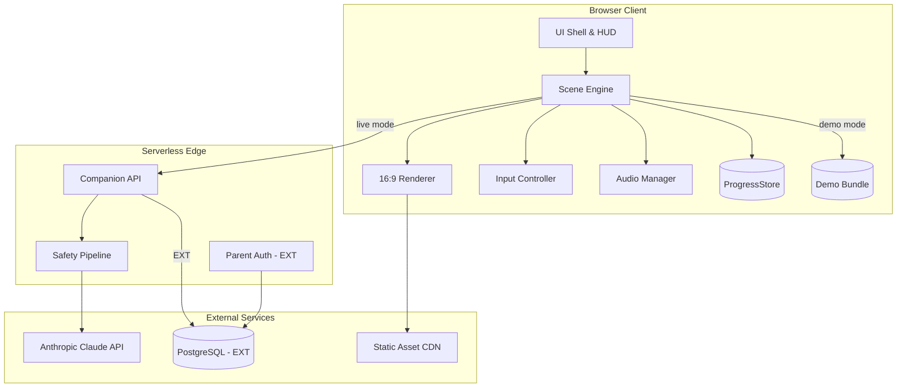
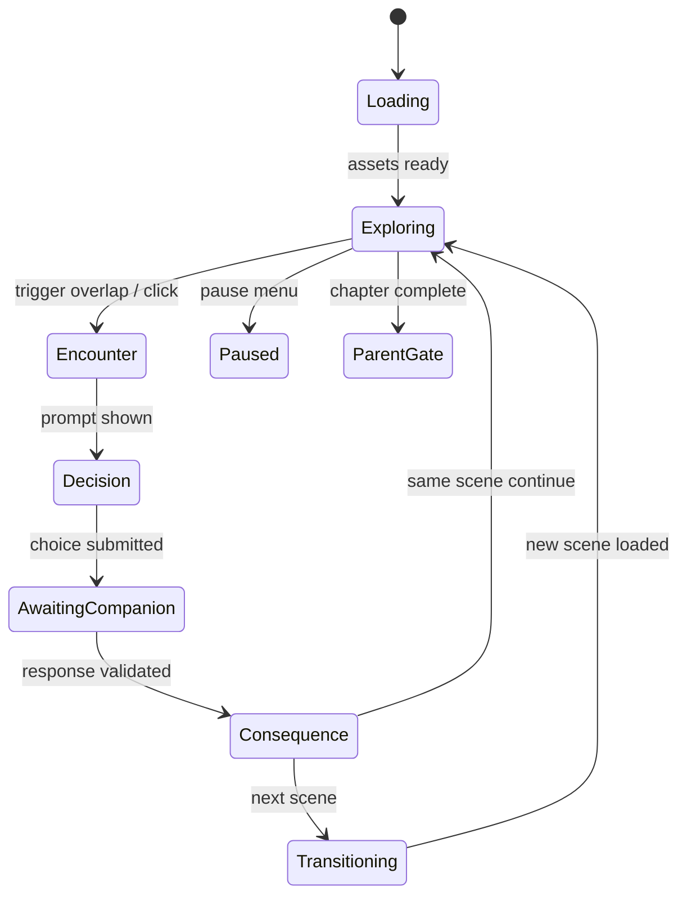
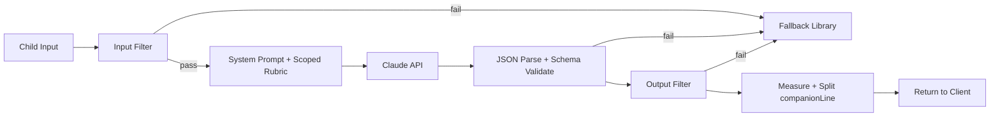

# TruNorth — Technical Specification

**Document type:** Engineering implementation guide  
**Derived from:** `TruNorth Master Spec.md` (Draft v2)  
**Audience:** Full-stack developers, technical leads, DevOps, QA  
**Owner:** Madhusudhan Chillara (Dallas AI · Summer 2026 Cohort)  
**Status:** Draft v1 — build-ready technical companion to the product spec  

---

## Table of contents

1. [Executive summary](#1-executive-summary)
2. [Architecture overview](#2-architecture-overview)
3. [Technology stack](#3-technology-stack)
4. [Repository & project structure](#4-repository--project-structure)
5. [Frontend: scene engine & runtime](#5-frontend-scene-engine--runtime)
6. [Screen, viewport & layout configuration](#6-screen-viewport--layout-configuration)
7. [Asset pipeline & image configuration](#7-asset-pipeline--image-configuration)
8. [Character system](#8-character-system)
9. [Content & scene data model](#9-content--scene-data-model)
10. [Game state & progression](#10-game-state--progression)
11. [AI companion & serverless proxy](#11-ai-companion--serverless-proxy)
12. [Persistence layer](#12-persistence-layer)
13. [Parent gate & trust surfaces](#13-parent-gate--trust-surfaces)
14. [Audio & feedback systems](#14-audio--feedback-systems)
15. [Demo mode & stage readiness](#15-demo-mode--stage-readiness)
16. [Security, privacy & compliance](#16-security-privacy--compliance)
17. [Testing & quality assurance](#17-testing--quality-assurance)
18. [DevOps, CI/CD & deployment](#18-devops-cicd--deployment)
19. [Performance budgets](#19-performance-budgets)
20. [Accessibility implementation](#20-accessibility-implementation)
21. [MVP vs EXT scope matrix](#21-mvp-vs-ext-scope-matrix)
22. [Implementation phases](#22-implementation-phases)
23. [Open engineering decisions](#23-open-engineering-decisions)

---

## 1. Executive summary

TruNorth is a **web-based, choice-driven narrative adventure** for children ages 5–15. Technically, it is **not a game-engine product**. It is a **content-driven scene-graph state machine** rendered in the browser with a custom lightweight runtime, an AI companion proxied server-side, and a frozen illustrated asset pipeline.

### 1.1 What engineers build


| Layer               | Responsibility                                                                                                        |
| ------------------- | --------------------------------------------------------------------------------------------------------------------- |
| **Scene runtime**   | Load scenes from JSON/YAML, render 16:9 letterboxed viewport, handle Tier A/B movement, decision points, consequences |
| **Companion proxy** | Serverless API holding Claude credentials; five-layer safety stack; structured JSON responses                         |
| **Progress store**  | Single `ProgressStore` interface; local (MVP) and remote (EXT) implementations                                        |
| **Asset system**    | Manifest-driven sprites, backgrounds, FX; expression-state swapping; progressive preload                              |
| **Parent surfaces** | Child-resistant gate, trust screen, watch/co-play mode                                                                |


### 1.2 Non-negotiable technical constraints (from product spec)

- **No game engine** (Phaser, Unity, Godot ruled out).
- **No API keys in the browser** — all Claude calls via serverless proxy.
- **No open-ended chat** — typed input scoped to active `decisionPointId`.
- **Demo mode must run fully offline** with zero network dependency.
- **MVP platform:** desktop, laptop, Chromebook with physical keyboard (touch deferred).
- **Safety stack is build-blocking** — movement (Tier B) yields to safety if schedule conflicts.

---

## 2. Architecture overview

### 2.1 High-level system diagram




### 2.2 Core architectural pattern

**Scene-graph state machine + single game state object.**

```
Scene Graph (content)     Game State (runtime)        Render Loop
─────────────────────     ────────────────────        ───────────
Scene W1 ──► W2           currentSceneId              rAF @ 60fps
     │         │          meters, points              DOM/canvas layers
     │         ▼          companionLevel              bubble tracking
     └──► W3a/W3b         emotionalResidue            overlap checks
              │           eventLog[]
              ▼
            W4
```

Every transition mutates one canonical `GameState` object persisted through `ProgressStore`. Scenes reference assets and routing by ID — never by file path in content files.

### 2.3 Tier A / Tier B movement abstraction

Movement is a **configurable layer**, not woven through scene logic:

```typescript
interface ChapterConfig {
  movementTier: 'A' | 'B';  // Tier B = keyboard + overlap; Tier A = click-to-trigger
}
```

Fallback from Tier B → Tier A is a **chapter-level flag**, not a rewrite.

---

## 3. Technology stack

The stack below balances the master spec's **vanilla, no-engine** mandate with **industrial full-stack standards**: type safety, automated testing, schema validation, observability, and a clear path from MVP (local-only) to EXT (accounts + sync).

### 3.1 Recommended stack (MVP + growth path)


| Concern                | Technology                                    | Rationale                                                                                                                    |
| ---------------------- | --------------------------------------------- | ---------------------------------------------------------------------------------------------------------------------------- |
| **Language**           | TypeScript 5.x                                | Type-safe scene schemas, rubric contracts, CI validation                                                                     |
| **Build tool**         | Vite 6.x                                      | Fast HMR, asset bundling, env injection, static export for offline demo                                                      |
| **Frontend framework** | **None (custom runtime)**                     | Master spec: no game engine; scene engine is purpose-built. Use Web Components or plain modules for UI chrome only if needed |
| **Rendering**          | DOM layers + optional Canvas 2D for particles | Spec: DOM + rAF movement loop; Canvas only for Bézier particle flight                                                        |
| **Styling**            | CSS Modules or vanilla CSS with design tokens | Predictable theming for parent gate vs child UI                                                                              |
| **State management**   | Custom `GameState` + event bus                | Single source of truth; no Redux overhead                                                                                    |
| **Content validation** | JSON Schema + Ajv                             | CI gate: scenes must validate including `emotionalArc`                                                                       |
| **Serverless runtime** | Vercel Edge Functions or Netlify Functions    | Spec-aligned; holds API keys server-side                                                                                     |
| **AI**                 | Anthropic Claude API (Haiku class default)    | Fast, cost-effective in-character turns                                                                                      |
| **MVP persistence**    | `localStorage` via `LocalProgressStore`       | Offline-capable, no accounts                                                                                                 |
| **EXT database**       | PostgreSQL via Supabase or Neon               | Managed, boring, auditable                                                                                                   |
| **EXT auth**           | Supabase Auth or Clerk (parent-only)          | Industry-standard OAuth/email; child does not authenticate                                                                   |
| **EXT object storage** | Supabase Storage or S3 + CloudFront           | Asset CDN, optional user uploads (none for children)                                                                         |
| **CI/CD**              | GitHub Actions                                | Lint, schema validate, unit tests, E2E, red-team harness                                                                     |
| **E2E testing**        | Playwright                                    | Keyboard movement, decision flows, demo mode offline                                                                         |
| **Unit/integration**   | Vitest                                        | Scene routing, scoring, safety filters                                                                                       |
| **Monitoring**         | Sentry (errors) + Vercel Analytics (non-PII)  | Production observability; no child transcript logging                                                                        |
| **Secrets**            | Vercel/Netlify env vars                       | Never in repo or client bundle                                                                                               |


### 3.2 Explicitly excluded


| Technology                   | Reason                                                              |
| ---------------------------- | ------------------------------------------------------------------- |
| Unity / Phaser / Godot       | Ruled out by product spec; wrong genre                              |
| React/Vue/Angular (full SPA) | Optional for parent dashboard only [EXT]; game runtime stays custom |
| WebSocket / real-time        | No multiplayer; request/response companion only                     |
| Browser Speech API [MVP]     | Privacy/COPPA; deferred to EXT with counsel gate                    |


### 3.3 Version pinning policy

- Pin major versions in `package.json`; use Dependabot for security patches.
- Lock Node.js to LTS (22.x) via `.nvmrc`.
- Document browser support matrix: **Chrome 120+**, **Edge 120+**, **Safari 17+** (demo machine is single-browser).

---

## 4. Repository & project structure

```
trunorth/
├── .github/
│   └── workflows/
│       ├── ci.yml                 # lint, test, schema validate
│       └── deploy.yml             # Vercel/Netlify deploy
├── api/                           # Serverless functions
│   ├── companion/
│   │   └── route.ts               # POST /api/companion
│   ├── health/
│   │   └── route.ts
│   └── auth/                      # [EXT] parent auth routes
├── content/
│   ├── schema/
│   │   ├── scene.schema.json
│   │   ├── decision-point.schema.json
│   │   └── game-state.schema.json
│   ├── chapters/
│   │   ├── ch1/
│   │   │   └── *.scene.json
│   │   └── ch2/
│   ├── demo/
│   │   └── showcase.bundle.json   # Frozen canned responses
│   └── fallbacks/
│       └── companion-fallbacks.json
├── public/
│   └── assets/                    # Built/static assets (see §7)
├── scripts/
│   ├── validate-content.ts
│   ├── build-asset-manifest.ts
│   └── red-team-suite.ts
├── src/
│   ├── engine/
│   │   ├── SceneEngine.ts
│   │   ├── SceneGraph.ts
│   │   ├── DecisionResolver.ts
│   │   ├── MovementController.ts
│   │   ├── CollisionSystem.ts
│   │   └── EmotionalResidue.ts
│   ├── render/
│   │   ├── Viewport.ts            # 16:9 letterbox
│   │   ├── SceneRenderer.ts
│   │   ├── SpriteLayer.ts
│   │   ├── BubbleManager.ts
│   │   ├── ParticleSystem.ts      # Bézier meter juice
│   │   └── DiegeticPath.ts        # Stepping-stone progress
│   ├── ui/
│   │   ├── MeterHUD.ts
│   │   ├── ChoicePanel.ts
│   │   ├── TypedInput.ts
│   │   ├── ParentGate.ts
│   │   ├── OnboardingFlow.ts
│   │   └── CelebrationScreen.ts
│   ├── audio/
│   │   └── AudioManager.ts
│   ├── store/
│   │   ├── ProgressStore.ts       # Interface
│   │   ├── LocalProgressStore.ts
│   │   └── RemoteProgressStore.ts # [EXT]
│   ├── companion/
│   │   ├── CompanionClient.ts
│   │   └── DemoCompanionClient.ts
│   ├── safety/                    # Client-side pre/post display
│   │   └── OutputSanitizer.ts
│   ├── types/
│   └── main.ts
├── tests/
│   ├── unit/
│   ├── e2e/
│   └── red-team/
├── assets-src/                    # Source art before manifest build
│   └── manifest.yaml
├── vite.config.ts
├── tsconfig.json
└── README.md
```

---

## 5. Frontend: scene engine & runtime

### 5.1 Scene engine responsibilities


| Module               | Responsibility                                                           |
| -------------------- | ------------------------------------------------------------------------ |
| `SceneEngine`        | Orchestrates load → explore → encounter → decide → consequence → route   |
| `SceneGraph`         | Resolves `nextSceneId` from consequence bands; bounded branching         |
| `DecisionResolver`   | Maps choice/typed input → `scoreBand`; updates meters; appends event log |
| `MovementController` | WASD/arrow keys; avatar position; idle animation                         |
| `CollisionSystem`    | AABB overlap for triggers, NPCs, collectibles                            |
| `EmotionalResidue`   | Per-character enum read/write from event log                             |


### 5.2 Main game loop

```typescript
// Pseudocode — requestAnimationFrame loop
function gameLoop(timestamp: number) {
  if (!state.inputFrozen) {
    movementController.update(delta);
    collisionSystem.checkTriggers(avatar, scene.triggers);
    bubbleManager.trackSpeakers(); // pin bubbles to sprite anchors
  }
  sceneRenderer.render(state, scene);
  requestAnimationFrame(gameLoop);
}
```

### 5.3 Scene lifecycle states




### 5.4 Input freeze during companion fetch

When `CompanionClient.request()` is in flight:

1. Unmap movement and trigger listeners.
2. Set avatar to idle animation.
3. Show companion "thinking" overlay (in-character, not spinner).
4. Release on resolve, fallback, or timeout.

This prevents `ProgressStore` race conditions (master spec §17B.9).

### 5.5 Dialogue system


| Feature            | Implementation                                                               |
| ------------------ | ---------------------------------------------------------------------------- |
| Overhead bubbles   | DOM elements anchored to sprite `anchorPoint`; flip below head near top edge |
| Progressive text   | Char-by-char reveal; tap-to-complete state machine (§17B.6 truth table)      |
| Bubble overflow    | Server splits `companionLine` > 120 chars; client sequences click-through    |
| Speaker sequencing | One active bubble at a time for Ch.1                                         |
| `pivotLockMs`      | Configurable per decision point; default 2000ms at emotional pivots          |


---

## 6. Screen, viewport & layout configuration

### 6.1 Canonical viewport

All game coordinates are **relative to a fixed logical canvas**:


| Property               | Value                                                                  |
| ---------------------- | ---------------------------------------------------------------------- |
| **Aspect ratio**       | 16:9 (locked)                                                          |
| **Logical resolution** | 1920 × 1080 (authoring reference)                                      |
| **Scaling**            | `transform: scale()` to fit viewport; letterbox bars on non-16:9       |
| **Coordinate system**  | Origin top-left; positions in logical px                               |
| **Z-order layers**     | background → world FX → characters → avatar → bubbles → HUD → overlays |


```css
/* Conceptual structure */
.game-viewport {
  aspect-ratio: 16 / 9;
  width: min(100vw, calc(100vh * 16 / 9));
  height: min(100vh, calc(100vw * 9 / 16));
  position: relative;
  overflow: hidden;
}
.letterbox-bar { background: #1a1a2e; }
```

### 6.2 Screen surfaces (MVP)


| Surface ID             | Route / state        | Primary layout                                |
| ---------------------- | -------------------- | --------------------------------------------- |
| `onboarding.parent`    | First launch         | Grown-up palette; age band + PIN setup        |
| `onboarding.companion` | Child flow           | Full-screen archetype picker + naming         |
| `onboarding.avatar`    | Child flow           | Skin/hair grid; no text required              |
| `onboarding.strength`  | Child flow           | Picture choices → `baselineStrength`          |
| `onboarding.movement`  | Tier B only          | Non-textual mimic tutorial                    |
| `game.scene`           | Active play          | 16:9 world + quiet meter HUD                  |
| `game.decision`        | Overlay on scene     | Large choice cards / typed field              |
| `game.celebration`     | Chapter end          | Full-screen high-saturation payoff            |
| `parent.gate`          | Between chapters     | Distinct grown-up surface; PIN/math           |
| `parent.trust`         | Settings / first-run | Plain-language companion boundaries           |
| `parent.watch`         | Side-by-side         | Child screen mirror + coach's corner          |
| `system.resume`        | Return visit         | In-character re-entry (distress-aware branch) |
| `system.error`         | API failure          | In-character line; never raw error            |


### 6.3 HUD configuration


| Element        | Position (logical 1920×1080) | Ch.1 visibility                   | Notes                           |
| -------------- | ---------------------------- | --------------------------------- | ------------------------------- |
| Skill meters   | Top-right cluster            | 3 meters (Empathy, Calm, Courage) | Animate only on change          |
| Brownie points | Top-left counter             | Always                            | Icon + number                   |
| Diegetic path  | Bottom-center in-world       | Optional 🟡                       | Stepping stones, not chrome bar |
| Demo mode pill | Top-left corner              | When active                       | "Demo Mode" indicator           |
| Pause          | Hidden corner tap            | Always                            | Calm freeze frame               |


### 6.4 Age-banded UI tokens

```typescript
const UI_TOKENS = {
  ch1: {
    hitTargetMinPx: 64,
    dialogueFontPx: 22,       // floor 20–24
    choiceCardHeight: 120,
    meterShowsNumbers: false,
  },
  ch2: {
    hitTargetMinPx: 48,
    dialogueFontPx: 18,
    typedInputEnabled: true,
  },
  ch3: {
    hitTargetMinPx: 48,
    dialogueFontPx: 16,       // floor
    typedInputPrimary: true,
  },
} as const;
```

### 6.5 Typography


| Use               | Font                   | Fallback               |
| ----------------- | ---------------------- | ---------------------- |
| Dialogue          | Quicksand or Nunito    | system-ui, sans-serif  |
| Dyslexia option   | Lexend                 | user setting           |
| Parent gate       | Inter or Source Sans 3 | distinct from child UI |
| Bubble text color | `#3d3d3d` on `#faf8f5` | contrast ≥ 4.5:1       |


### 6.6 Projector / demo display

- Test showcase scene at **1024×768** and **1920×1080**.
- Meter fill animations must be legible from ~15m (master spec §13A.4).
- Global mute control; venue may have no audio.

---

## 7. Asset pipeline & image configuration

### 7.1 Art style lock

- **Style:** AI-generated "clean cartoon" — single frozen style guide document.
- **Lock window:** Week 1–2; no regeneration after freeze without version bump.
- **Review gate:** SME + art lead sign-off before `manifest.lock`.

### 7.2 Image format & export standards


| Asset type               | Format                  | Resolution (logical) | Notes                         |
| ------------------------ | ----------------------- | -------------------- | ----------------------------- |
| Scene backgrounds        | WebP (PNG fallback)     | 1920 × 1080          | Full-bleed; safe zone for HUD |
| Character sprites        | WebP + PNG              | See §7.3             | Transparent background        |
| Companion level variants | WebP                    | Same base dimensions | Swapped at level thresholds   |
| UI chrome / meters       | SVG where possible      | Scalable             | CSS-tintable meter fills      |
| Particles / FX           | CSS + small PNG sprites | 32–64px              | Low count (8–12 per burst)    |
| Celebration cards        | WebP                    | 1920 × 1080          | Full-screen overlay           |
| Audio                    | MP3 + OGG               | —                    | Short SFX < 100KB             |


### 7.3 Character sprite specifications


| Property                     | Specification                                                     |
| ---------------------------- | ----------------------------------------------------------------- |
| **Anchor point**             | Feet center for ground characters; `(0.5, 1.0)` of sprite         |
| **Bubble anchor**            | Head top; `(0.5, 0.0)` + offset −24px                             |
| **Base size (child avatar)** | 128 × 128 logical px (Ch.1); scale uniformly                      |
| **Base size (companion)**    | 160 × 160 logical px                                              |
| **Base size (NPC)**          | 144 × 144 logical px                                              |
| **Expression states**        | Minimum 3 per character: `neutral`, `worried_sad`, `excited_glow` |
| **Poor-band body language**  | Scale 0.92 + slight tilt; SME reviews animated                    |
| **Directionality**           | 4-way or flip-X for left/right movement                           |
| **Animation**                | Sprite sheet or stepped poses: `idle`, `walk`, `react`            |


### 7.4 Asset manifest schema

Scenes reference `assetRef`, never paths:

```yaml
# assets-src/manifest.yaml
version: "1.0.0"
styleGuide: docs/art-style-guide.md

characters:
  companion_fox_base:
    file: characters/companion/fox_base.webp
    width: 160
    height: 160
    anchor: [0.5, 1.0]
    expressions:
      neutral: { frame: 0 }
      worried_sad: { frame: 1 }
      excited_glow: { frame: 2, glow: true }
    levels:
      1: companion_fox_base
      2: companion_fox_level2
      3: companion_fox_level3

  robin:
    file: characters/npc/robin.webp
    width: 144
    height: 144
    expressions:
      neutral: { frame: 0 }
      worried: { frame: 1 }
      relieved_grin: { frame: 2 }

backgrounds:
  clearing_treehouse:
    file: backgrounds/ch2/clearing_day.webp
    width: 1920
    height: 1080

fx:
  worry_cloud_lg:
    file: fx/worry_cloud_big.webp
    width: 200
    height: 120
    variants: [big, medium, small, gone]
```

Build script `build-asset-manifest.ts` emits `public/assets/manifest.json` and validates all files exist.

### 7.5 Avatar configuration (player representation)

```typescript
interface AvatarConfig {
  skinTone: 'tone_1' | 'tone_2' | 'tone_3' | 'tone_4' | 'tone_5';
  hair: 'hair_curly' | 'hair_straight' | 'hair_braids' | 'hair_short' | 'hair_puffs';
}
```

- Composed from **layered sprites** (body base + hair overlay) or pre-composed variants.
- 5×5 matrix maximum for MVP; expand post-launch.
- Stored on child profile; rendered as movement sprite in Tier B.

### 7.6 Preload strategy


| Phase         | Assets loaded                                         |
| ------------- | ----------------------------------------------------- |
| App boot      | Core UI, fonts, companion base, avatar                |
| Chapter enter | All backgrounds + NPCs for chapter                    |
| Scene enter   | Scene-specific FX, audio cues                         |
| Showcase demo | **Entire** W1–W4 path preloaded before stage (§13A.5) |


Use `Promise.all` + progress "Ready" gate for demo presenter.

### 7.7 Showcase scene asset checklist (Appendix C §F)


| Asset                        | assetRef                     | States / variants                 |
| ---------------------------- | ---------------------------- | --------------------------------- |
| Sunny clearing + treehouse   | `bg_clearing_day`            | 1                                 |
| Treehouse close-up (W4)      | `bg_treehouse_rung`          | 1                                 |
| Robin                        | `char_robin`                 | worried, shaky_nod, relieved_grin |
| Companion (chosen archetype) | `char_companion_`*           | neutral, proud, glow              |
| Child avatar                 | `char_avatar_*`              | walk, idle                        |
| Worry cloud                  | `fx_worry_cloud`             | big → medium → small → gone       |
| Celebration                  | `ui_celebration_worry_brave` | 1                                 |
| Worry & Brave meter art      | `ui_meter_worry_brave`       | empty, partial, full              |
| Brownie / Kindness Spark     | `collectible_spark`          | default, hidden                   |


---

## 8. Character system

### 8.1 Character taxonomy


| Type                | ID prefix    | Customizable                  | AI voice               |
| ------------------- | ------------ | ----------------------------- | ---------------------- |
| **Player avatar**   | `avatar_`    | Skin, hair                    | N/A                    |
| **Companion**       | `companion_` | Name (child-given), archetype | Full Claude persona    |
| **Supporting NPC**  | `npc_`       | None                          | Authored dialogue only |
| **Grown-up figure** | `npc_adult_` | None                          | Ask-for-help anchor    |


### 8.2 Companion archetypes (configurable asset set)


| ID                  | Archetype                             | MVP candidate   |
| ------------------- | ------------------------------------- | --------------- |
| `companion_fox`     | Friendly animal                       | **Recommended** |
| `companion_sprite`  | Magical spirit                        | **Recommended** |
| `companion_kid`     | Kid friend                            | Roadmap         |
| `companion_robot`   | Gadget pal                            | Roadmap         |
| `companion_shifter` | Level-up morph                        | Roadmap         |
| `companion_duo`     | Pair (primary named, secondary fixed) | Roadmap         |


Archetype selection swaps asset set + `{COMPANION_VOICE}` flavor table — **not** safety or scoring logic.

### 8.3 Companion naming pipeline

```typescript
interface CompanionContext {
  name: string;              // child-given; injected in prompts as {NAME}
  archetypeId: string;
  level: 1 | 2 | 3;
  voiceProfile: VoiceProfile;
}
```

- Name stored in `GameState.profile.companionName`.
- Validated: max 20 chars; profanity filter; no PII patterns.
- Default suggestions: `["Pip", "Spark", "Buddy", "Luna", "Ash"]`.

### 8.4 Expression state machine

```typescript
type ExpressionState = 'neutral' | 'worried_sad' | 'excited_glow';

function expressionForBand(band: ScoreBand, sensitivity: ThemeSensitivity): ExpressionState {
  if (band === 'strong') return 'excited_glow';
  if (band === 'poor' && sensitivity === 'standard') return 'worried_sad';
  return 'neutral';
}
```

`companionStance` from `emotionalArc` selects among loaded expression assets — does not define new art.

### 8.5 Supporting cast (MVP narrative vehicles)


| Character              | ID            | Themes              | Expression states   |
| ---------------------- | ------------- | ------------------- | ------------------- |
| Left-out kid           | `npc_leftout` | Empathy, Friendship | 3 min               |
| Hot-tempered friend    | `npc_hothead` | Calm                | 3 min               |
| Worried friend (Robin) | `npc_robin`   | Worry & Brave       | 3 min + worry cloud |
| Family-changing friend | `npc_sam`     | Adapting to Change  | 3 min; SME draft    |
| Self-doubter           | `npc_doubter` | Self-Worth          | 3 min               |
| Kid who messed up      | `npc_messup`  | Friendship & Repair | 3 min               |
| Trusted grown-up       | `npc_grownup` | Ask for Help        | 3 min               |


### 8.6 Emotional residue (per chapter)

```typescript
type ResidueLevel = 'trusting' | 'neutral' | 'shaken';

interface ChapterResidue {
  [npcId: string]: ResidueLevel;
}
```

- Derived from event log after NPC decision points.
- Affects NPC default expression and companion opener — never blocks progress.
- Off by default for Ch.1 if SME judges too subtle.

---

## 9. Content & scene data model

### 9.1 Scene schema (authoritative)

```json
{
  "id": "w2",
  "chapterId": "ch2",
  "order": 2,
  "movementTier": "B",
  "background": "bg_clearing_day",
  "narration": "Robin keeps looking up at the ladder…",
  "characters": [
    { "assetRef": "char_robin", "id": "robin", "position": [960, 720], "expression": "worried" },
    { "assetRef": "char_companion_fox", "id": "companion", "position": [720, 780] }
  ],
  "triggers": [
    { "id": "robin_encounter", "bounds": [880, 680, 160, 160], "action": "startDecision", "target": "dp_robin_ladder" }
  ],
  "collectibles": [
    { "id": "spark_1", "assetRef": "collectible_spark", "position": [400, 800], "kind": "kindness_spark", "gate": "strong_path" }
  ],
  "decisionPoints": ["dp_robin_ladder"]
}
```

### 9.2 Decision point schema

```json
{
  "id": "dp_robin_ladder",
  "prompt": "Robin is scared to climb. What do you do?",
  "inputMode": "both",
  "themeSensitivity": "standard",
  "selSkills": ["worry_brave", "empathy"],
  "pivotLockMs": 2000,
  "options": [
    {
      "id": "opt_a",
      "label": "It's okay to feel scared. Want to try just the first step together?",
      "icon": "icon_helping_hand",
      "selScore": "strong",
      "consequenceRef": "cons_w2_strong"
    }
  ],
  "companionContext": {
    "situation": "Robin frozen at ladder, worry cloud visible",
    "npcEmotion": "anxiety",
    "ageBand": "8-10"
  },
  "consequences": [
    {
      "band": "strong",
      "sceneId": "w3a",
      "fx": ["worry_cloud_shrink"],
      "meterDeltas": { "worry_brave": 1.0, "empathy": 0.25 },
      "repairAction": null
    },
    {
      "band": "poor",
      "sceneId": "w2",
      "fx": ["worry_cloud_darken"],
      "repairAction": "walk-back"
    }
  ],
  "emotionalArc": {
    "childStateEntering": "curious, slightly concerned",
    "childStateExiting": {
      "strong": "empowered, proud, connected",
      "partial": "uncertain, nudged toward reflection",
      "poor": "guilty-but-safe (shame interrupted immediately)"
    },
    "companionStance": {
      "strong": "warm, upright, light glow",
      "partial": "leaned-in, soft-voiced, waits for child",
      "poor": "kneels-to-child-level, soft-eyes, no-glow; interposes"
    },
    "recoveryCadence": "poor → companion intervenes before dead air → touch + one line → repairAction opens"
  }
}
```

### 9.3 CI validation rules

- Every `DecisionPoint` must include complete `emotionalArc` (4 fields).
- `themeSensitivity: sensitive` → playful externalization disabled in code path.
- All `assetRef` values must exist in manifest.
- `consequenceRef` / routing must not create unreachable scenes.
- Golden path smoke test: W1 → W2 → W3a → W4 completes in < 3 minutes.

### 9.4 Repair actions

```typescript
type RepairAction = 'walk-back' | 'offer-hand' | 'sit-with' | 'tap-kind-action';
```

Poor/partial bands may require child-performed gesture before re-choice — not bare re-click.

---

## 10. Game state & progression

### 10.1 GameState object

```typescript
interface GameState {
  version: 1;
  profile: {
    childDisplayName?: string;
    ageBand: '5-7' | '8-10' | '11-15';
    chapterId: string;
    avatar: AvatarConfig;
    companionName: string;
    companionArchetype: string;
    baselineStrength: string;
  };
  progress: {
    currentSceneId: string;
    chaptersUnlocked: string[];
    chaptersCompleted: string[];
    browniePoints: number;
    kindnessSparksFound: Record<string, string[]>;
  };
  meters: Record<SkillId, { fill: number; level: number }>;
  companion: { level: 1 | 2 | 3; appearanceRef: string };
  emotionalResidue: Record<string, ChapterResidue>;
  parentGate: { lastPassedChapter: string | null; pinHash?: string };
  flags: {
    demoMode: boolean;
    lastSafetyFlag: SafetyFlag | null;
    onboardingComplete: boolean;
  };
  eventLog: GameEvent[];
}
```

### 10.2 Skill meters (canonical 7)

```typescript
type SkillId =
  | 'empathy'
  | 'calm'
  | 'courage'
  | 'self_worth'
  | 'adapting_to_change'
  | 'friendship_repair'
  | 'worry_brave';
// ask_for_help: cross-cutting, no meter
```

**Display schedule:** Ch.1 shows 3; others revealed per §7.2. All 7 tracked from launch.

### 10.3 Meter fill / juice pipeline

On `strong` band:

1. Companion bounce animation.
2. 8–12 particles along quadratic Bézier to meter (rAF, not CSS easing).
3. Meter fill animation + harp SFX.
4. Optional world bloom (flowers, path brighten) for Ch.1.

### 10.4 Auto-save

- Persist to `ProgressStore` on **every decision point resolution**.
- Debounce 0ms — immediate write after state mutation.
- `LocalProgressStore`: `localStorage` key `trunorth_save_v1`.

---

## 11. AI companion & serverless proxy

### 11.1 API endpoint

```
POST /api/companion
Content-Type: application/json
```

**Request:**

```json
{
  "decisionPointId": "dp_robin_ladder",
  "sceneId": "w2",
  "chapterId": "ch2",
  "ageBand": "8-10",
  "inputMode": "typed",
  "childInput": "It's okay to be scared, I'll go with you.",
  "companionContext": { },
  "strengthsSnapshot": ["empathy_strong:2"],
  "companion": { "name": "Pip", "archetype": "companion_fox" }
}
```

**Response (validated JSON):**

```json
{
  "scoreBand": "strong",
  "skill": "worry_brave",
  "matchedCriterion": "names_feeling_and_supports",
  "confidence": 0.91,
  "companionLine": "You said the scared part out loud — that helps it feel smaller.",
  "redirect": false,
  "safetyFlag": "none"
}
```

### 11.2 Safety pipeline (server-side)




| Layer             | Checks                                                     |
| ----------------- | ---------------------------------------------------------- |
| Input filter      | Length cap, profanity, PII, jailbreak heuristics, on-topic |
| Prompt            | Full persona + safety; scoped rubric subset only           |
| Structured output | Zod/JSON Schema validation                                 |
| Output filter     | Reading level, persona, length, no clinical language       |
| Fallback          | SME-approved lines per `decisionPointId × band`            |


### 11.3 Confidence routing

```typescript
const CONFIDENCE_FLOOR = 0.55;

if (response.confidence < CONFIDENCE_FLOOR) {
  response.scoreBand = 'partial';
  response.companionLine = fallbackLibrary.get(decisionPointId, 'partial');
}
```

### 11.4 Latency & timeout


| Parameter   | Value                            |
| ----------- | -------------------------------- |
| Model       | Claude Haiku (configurable)      |
| Timeout     | 8s hard                          |
| Retries     | 1 silent retry                   |
| Thinking UI | Show after 300ms                 |
| Fallback    | On timeout or validation failure |


### 11.5 Environment variables (server only)

```
ANTHROPIC_API_KEY=
COMPANION_MODEL=claude-3-5-haiku-latest
CONFIDENCE_FLOOR=0.55
NODE_ENV=production
```

---

## 12. Persistence layer

### 12.1 ProgressStore interface

```typescript
interface ProgressStore {
  load(): Promise<GameState | null>;
  save(state: GameState): Promise<void>;
  clear(): Promise<void>;
  appendEvent(event: GameEvent): Promise<void>;
}
```

### 12.2 LocalProgressStore [MVP]

- Storage: `localStorage` + optional IndexedDB for event log if size grows.
- Encryption: not required for MVP (no accounts); document as EXT hardening.
- Quota handling: prune event log to last N events keeping `strengthsSnapshot`.

### 12.3 RemoteProgressStore [EXT]


| Table            | Key fields                                           |
| ---------------- | ---------------------------------------------------- |
| `parents`        | id, email, auth_provider_id                          |
| `child_profiles` | id, parent_id, display_name, age_band, avatar_json   |
| `progress`       | child_id, game_state_json, updated_at                |
| `events`         | child_id, event_json (derived fields only on server) |


- API: `GET/PUT /api/progress/:childId`
- Auth: parent JWT; child profile selected in session.
- Sync conflict: last-write-wins with `updated_at` (MVP backend); CRDT not needed.

### 12.4 Event log schema

Per master spec §11.5 — append-only, one record per resolved decision.

---

## 13. Parent gate & trust surfaces

### 13.1 Parent gate


| Property      | Specification                                    |
| ------------- | ------------------------------------------------ |
| Trigger       | Between chapters (default)                       |
| Auth [MVP]    | 4-digit PIN or math challenge                    |
| Auth [EXT]    | Parent account session                           |
| Fail behavior | 3 fails → 30–60s cool-down; return to safe idle  |
| Visual        | Cool/dark palette; no companion; lock icon       |
| Checklist     | Connection-framed toggles; not behavior contract |


### 13.2 Watch / co-play mode

- Renders duplicate game viewport for parent.
- Coach's corner: current `selSkills`, conversation prompt.
- **Co-play:** parent sees prompts; **cannot** override child input.

### 13.3 Trust screen (§17E)

Static content + SME sign-off; documents:

- Fixed character, no open chat
- No real-world meetups or PII collection
- Distress protocol summary
- What data is stored locally vs remotely

---

## 14. Audio & feedback systems

### 14.1 Sound map (MVP)


| Event               | Asset                    | Volume              |
| ------------------- | ------------------------ | ------------------- |
| Ambient exploration | `ambient_clearing.mp3`   | Low (loop)          |
| Brownie pickup      | `sfx_pickup_chime.mp3`   | Medium              |
| Strong choice       | `sfx_harp_swell.mp3`     | Medium-high         |
| Poor setback        | `sfx_soft_thud.mp3`      | Low (not punishing) |
| Celebration         | `sfx_celebration.mp3`    | High (mutable)      |
| Companion thinking  | `sfx_thinking_bloop.mp3` | Low                 |


### 14.2 Stimulation budget (enforcement)

Engine tags current `GameStatePhase` and clamps particles/SFX per master spec §17B.2 table.

### 14.3 Voice-over [EXT for youngest band]

- Ch.1 narration + options voiced.
- Tied to tap-handler truth table: cannot advance until audio completes when VO active.

---

## 15. Demo mode & stage readiness

### 15.1 Activation

```typescript
const demoMode =
  import.meta.env.VITE_DEMO_MODE === 'true' ||
  new URLSearchParams(location.search).has('demo');
```

### 15.2 Behavior when `demoMode === true`


| System          | Behavior                                           |
| --------------- | -------------------------------------------------- |
| Companion       | `DemoCompanionClient` reads `showcase.bundle.json` |
| Network         | Zero fetch to `/api/companion`                     |
| Analytics       | Disabled                                           |
| External assets | All preloaded from bundle                          |
| Voice input     | Disabled                                           |
| Indicator       | Visible "Demo Mode" pill                           |


### 15.3 Canned response bundle key

```
{sceneId}:{decisionPointId}:{band} → { companionLine, scoreBand, ... }
```

Include golden path + branches B/C + typed band examples.

### 15.4 Offline run command

```bash
npm run build
npx serve dist -l 4173
# Open http://localhost:4173?demo=1
```

### 15.5 Fallback ladder

1. Live API → 2. Demo mode → 3. Offline localhost → 4. Recorded backup video

---

## 16. Security, privacy & compliance

### 16.1 Threat model (MVP)


| Threat                     | Mitigation                                 |
| -------------------------- | ------------------------------------------ |
| API key exfiltration       | Serverless proxy only                      |
| Prompt injection           | Input filter + structured prompt           |
| Unsafe model output        | Output filter + fallback                   |
| Child PII in prompts       | Pre-model PII screen                       |
| XSS from child typed input | Sanitize before render; `textContent` only |
| Child bypasses parent gate | PIN/math + distinct UI                     |


### 16.2 Data minimization


| Data               | MVP               | EXT backend                                     |
| ------------------ | ----------------- | ----------------------------------------------- |
| Child display name | local             | parent-managed                                  |
| Typed `rawInput`   | local only        | **derived fields only** unless counsel approves |
| Safety flags       | local             | parent dashboard alert                          |
| Analytics          | none or aggregate | non-PII only                                    |


### 16.3 COPPA [EXT gate]

- Parent-owned accounts only.
- Verifiable parental consent before cloud storage.
- Privacy policy + SME/counsel review before real child accounts.

### 16.4 Grump-Cloud / externalization gate

```typescript
function canUsePlayfulExternalization(dp: DecisionPoint): boolean {
  return dp.themeSensitivity === 'standard';
}
```

Hard-disabled for `sensitive` — code-level, not author memory.

---

## 17. Testing & quality assurance

### 17.1 Test pyramid


| Layer         | Tool                    | Coverage target                               |
| ------------- | ----------------------- | --------------------------------------------- |
| Unit          | Vitest                  | Scene routing, scoring, residue, bubble split |
| Schema        | Ajv + CI                | All content files                             |
| Integration   | Vitest                  | ProgressStore, companion client mock          |
| E2E           | Playwright              | Golden path, parent gate, resume              |
| Red-team      | Custom harness          | Adversarial input suite (§9.6)                |
| Accessibility | axe-core + manual       | Showcase scene                                |
| Visual        | Manual + projector test | Demo legibility                               |


### 17.2 Red-team categories (required)

- Jailbreak / instruction override
- Profanity / hostile input
- PII solicitation responses
- Off-topic / real-world meetup
- Distress / self-harm phrasing → distress protocol
- Model timeout / malformed JSON

### 17.3 Acceptance test: "text-off" emotional read

Play showcase scene with dialogue hidden; emotional arc must read from posture + world FX alone.

---

## 18. DevOps, CI/CD & deployment

### 18.1 CI pipeline (GitHub Actions)

```yaml
# Conceptual steps
- npm ci
- npm run lint
- npm run typecheck
- npm run validate:content    # JSON Schema
- npm run test:unit
- npm run test:red-team
- npm run build
- npm run test:e2e            # against preview build
```

### 18.2 Deployment


| Environment  | Host              | Branch      |
| ------------ | ----------------- | ----------- |
| Preview      | Vercel preview    | PR branches |
| Production   | Vercel production | `main`      |
| Demo offline | `dist/` folder    | local       |


### 18.3 Infrastructure (EXT)

- Supabase project: Postgres + Auth + Storage
- Row-level security: parent can only read own child profiles
- No child-direct API access

---

## 19. Performance budgets


| Metric                    | Target                                  |
| ------------------------- | --------------------------------------- |
| Initial load (showcase)   | < 3s on demo laptop                     |
| Scene transition          | < 1s                                    |
| Companion response (live) | < 3s perceived (thinking UI @ 300ms)    |
| Game loop                 | 60fps on Chromebook                     |
| Particle burst            | ≤ 12 simultaneous                       |
| Total showcase bundle     | < 15MB preloaded                        |
| Lighthouse Performance    | ≥ 85 (best effort; game-like apps vary) |


---

## 20. Accessibility implementation


| Requirement          | Implementation                                    |
| -------------------- | ------------------------------------------------- |
| Keyboard operability | Full scene navigation + choices Tab/Enter         |
| Focus indicator      | Visible `:focus-visible` ring                     |
| Screen reader        | ARIA on choices, meters, bubbles                  |
| Contrast             | 4.5:1 dialogue; meter icon + color                |
| Reduced motion       | `prefers-reduced-motion` disables shake/particles |
| Seizure safety       | No flash > 3Hz                                    |
| Font option          | Lexend toggle in settings                         |
| Audio                | Never sole feedback channel                       |


---

## 21. MVP vs EXT scope matrix


| Feature                           | MVP         | EXT               |
| --------------------------------- | ----------- | ----------------- |
| Scene engine Tier B               | ✅           |                   |
| Tier A fallback flag              | ✅           |                   |
| Claude companion + safety stack   | ✅           |                   |
| LocalProgressStore                | ✅           |                   |
| RemoteProgressStore               |             | ✅                 |
| Parent PIN gate                   | ✅           |                   |
| Parent account gate               |             | ✅                 |
| Demo mode + offline bundle        | ✅           |                   |
| 7 meters tracked / progressive UI | ✅           |                   |
| Onboarding + baselineStrength     | ✅ (seed 🟢) |                   |
| Parent trust + watch mode         | ✅           |                   |
| Parent dashboard                  |             | ✅                 |
| Emotion mini-games                |             | ✅                 |
| Voice input                       |             | ✅ (privacy gated) |
| Touch keyboard reflow             |             | ✅                 |
| COPPA cloud compliance            |             | ✅                 |


---

## 22. Implementation phases

Aligned with master spec §19:

### Phase 1 — Week 1–2: Foundation & art lock

- [ ] Repo scaffold (Vite + TypeScript + CI)
- [ ] Asset manifest pipeline + style lock
- [ ] JSON Schema for scenes / decision points
- [ ] 16:9 viewport renderer shell
- [ ] Showcase scene content + SME review
- [ ] Generate + freeze Appendix C assets

### Phase 2 — Week 2–3: Vertical slice

- [ ] Scene engine: W1 → W2 → W3a → W4 golden path
- [ ] Decision resolver + meter juice
- [ ] Companion proxy + safety stack v1
- [ ] `DEMO_MODE` + `showcase.bundle.json`
- [ ] `LocalProgressStore` + auto-save
- [ ] W4 participatory climb (3 taps)

### Phase 3 — Week 3–4: Breadth

- [ ] Full Ch.1 + Ch.2 scenes
- [ ] Parent gate (visual + PIN)
- [ ] Fallback library populated
- [ ] Onboarding flow
- [ ] Celebration / graduation screens
- [ ] Parent trust screen + watch mode

### Phase 4 — Week 4–5: Hardening

- [ ] Red-team suite green
- [ ] Empty/error/resume states
- [ ] Projector resolution verification
- [ ] Recorded backup video
- [ ] Accessibility pass on showcase
- [ ] Scope freeze

### Phase 5 — Post-MVP [EXT]

- [ ] Supabase backend + parent auth
- [ ] RemoteProgressStore
- [ ] Parent dashboard
- [ ] Mini-games module

---

## 23. Open engineering decisions


| #   | Decision                         | Default                               | Owner          |
| --- | -------------------------------- | ------------------------------------- | -------------- |
| 1   | Canvas vs DOM-only particles     | DOM + rAF Bézier                      | Build lead     |
| 2   | Sprite sheets vs individual WebP | Sprite sheets for animated characters | Art + Build    |
| 3   | Exact confidence floor           | 0.55                                  | SME + Safety   |
| 4   | PIN storage                      | hashed in localStorage                | Build          |
| 5   | Ch.1 voice-over scope            | SFX + music only for MVP              | Owner          |
| 6   | Supabase vs custom API           | Supabase for EXT speed                | Build lead     |
| 7   | Event log local retention cap    | 200 events                            | Privacy review |


---

## Appendix A — Quick reference: showcase golden path

```
W1 (explore → Robin) → W2 (Option A: strong) → W3a (consequence) → W4 (3-tap climb + celebration)
```

**Demo:** `?demo=1` — no network, canned companion lines, preloaded assets.

**Stage deliberate detour:** Option C once to prove adaptivity, then recover.

---

## Appendix B — Reference documents


| Document                        | Purpose                 |
| ------------------------------- | ----------------------- |
| `TruNorth Master Spec.md`       | Product source of truth |
| Appendix A (Persona Contract)   | System prompt content   |
| Appendix B (SEL Rubric)         | Scoring criteria        |
| Appendix C (Showcase Scripts)   | Demo content + assets   |
| Appendix D (Adapting to Change) | Sensitive theme draft   |


---

*This technical specification implements the [MVP] tier first. [EXT] items are designed in but must not block showcase delivery. Where clinical, legal, or pedagogical judgment is required, build the mechanism and route policy to Owner + SME + counsel.*